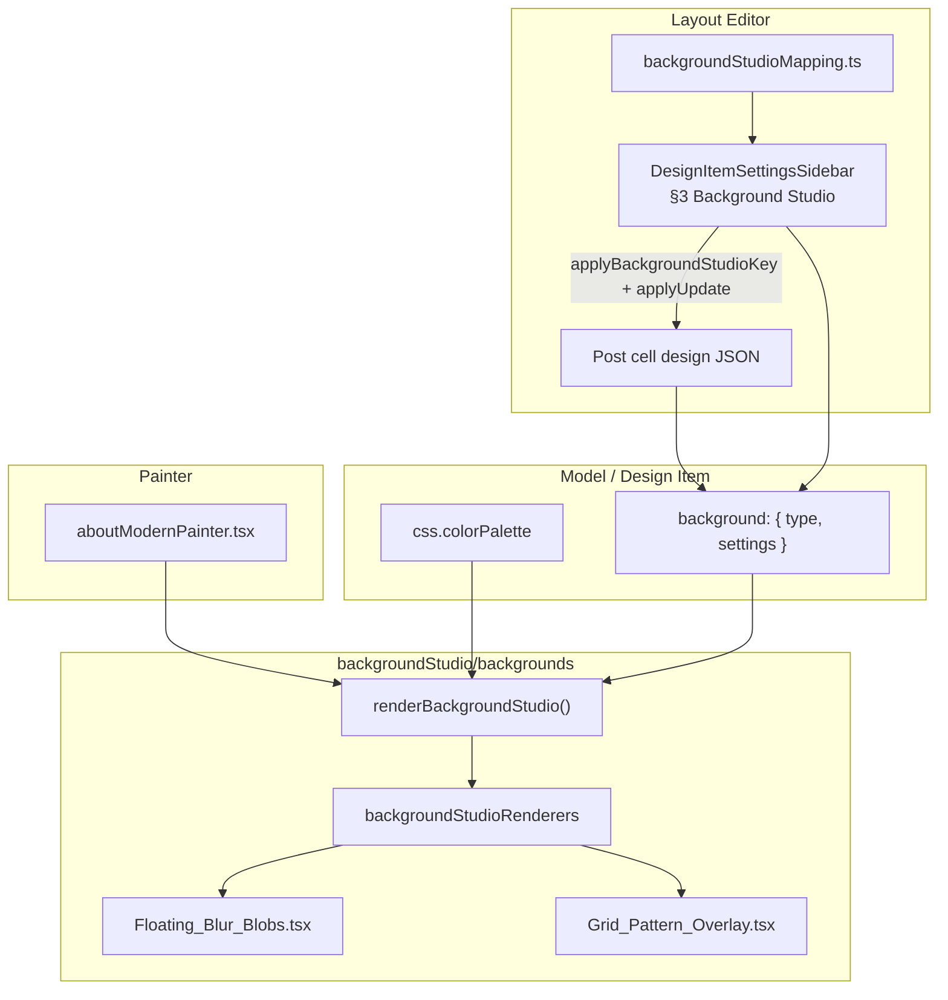

# Background Studio — Integration & Creation Guide

This document describes the **Background Studio** system: how animated/decorative backgrounds are defined on design items, edited in the layout sidebar, and rendered in painters. It covers the full integration built for `aboutModern` and the pattern for adding new background types.

---

## Table of Contents

1. [Overview](#overview)
2. [Architecture](#architecture)
3. [Data model](#data-model)
4. [File structure](#file-structure)
5. [Layout editor (sidebar)](#layout-editor-sidebar)
6. [Painter integration](#painter-integration)
7. [Built-in background types](#built-in-background-types)
8. [Theme & color palette](#theme--color-palette)
9. [Adding a new background type](#adding-a-new-background-type)
10. [Model data defaults](#model-data-defaults)
11. [Save & preview behavior](#save--preview-behavior)
12. [Troubleshooting](#troubleshooting)
13. [Checklist](#checklist)

---

## Overview

Background Studio lets each **design item** carry an optional `background` field:

- **`type`** — which background renderer to use (`FloatingBlobs`, `GridPatternOverlay`, or effectively none).
- **`settings`** — JSON configuration passed to that renderer (shape depends on the type).

The system mirrors other drafting registries (animations, wrappers, lists):

| Layer | Role |
|--------|------|
| **Mapping** | Default presets per type (sidebar dropdown) |
| **Components** | React implementations under `backgroundStudio/backgrounds/` |
| **Registry** | `type` → renderer function in `index.tsx` |
| **Runtime** | `renderBackgroundStudio()` called from painters |

**Primary reference painter:** `src/drafting/painter/about/aboutModernPainter.tsx`  
**Primary model example:** `aboutModern` in `src/drafting/modelData/about.ts`

---

## Architecture



**End-to-end flow:**

1. Model or sidebar sets `item.background`.
2. Sidebar dropdown picks a key from `backgroundStudioMapping` → writes `type` + default `settings` → **auto-saves** via `applyUpdate`.
3. Painter reads `item.background` and `item.css.colorPalette`.
4. `renderBackgroundStudio()` returns the matching component or `null` for **None** / empty config.
5. Painter places the layer behind content (`z-0`), content at `z-10`.

---

## Data model

### Shape on the design item

```typescript
// Top-level field on DraftDesignItem / model entries
background?: {
  type?: string;      // e.g. "FloatingBlobs", "GridPatternOverlay"
  settings?: unknown; // array or object — depends on type
}
```

### Examples

**No background (None):**

```json
{}
```

**Floating blobs:**

```json
{
  "type": "FloatingBlobs",
  "settings": [
    {
      "className": "w-72 h-72 top-10 left-10",
      "duration": 10,
      "colorKey": "primary"
    },
    {
      "className": "w-96 h-96 bottom-10 right-10",
      "duration": 14,
      "colorKey": "accent"
    }
  ]
}
```

**Grid pattern overlay:**

```json
{
  "type": "GridPatternOverlay",
  "settings": {
    "className": "",
    "gridSize": 40,
    "lineOpacity": 0.05,
    "colorKey": "text"
  }
}
```

### When nothing renders

`renderBackgroundStudio()` returns `null` if:

- `background` is missing, not an object, or `{}`
- `type` is missing, empty, or `"None"`
- `type` is not registered in `backgroundStudioRenderers`

---

## File structure

```
src/drafting/layoutEditor/backgroundStudio/
├── backgroundMapping.ts          # Presets for sidebar dropdown (keys → default settings)
└── backgrounds/
    ├── types.ts                  # Shared TS types (palette, context, config)
    ├── backgroundUtils.ts        # Shared palette/motion helpers
    ├── Floating_Blur_Blobs.tsx   # FloatingBlobs
    ├── Grid_Pattern_Overlay.tsx  # GridPatternOverlay
    ├── Animated_Gradient_Background.tsx
    ├── Aurora_Mesh_Background.tsx
    ├── Dot_Pattern_Background.tsx
    ├── Noise_Grain_Background.tsx
    ├── Geometric_Shapes_Background.tsx
    ├── Spotlight_Glow_Background.tsx
    ├── Wave_Lines_Background.tsx
    ├── Particle_Field_Background.tsx
    ├── Conic_Gradient_Background.tsx
    ├── Glass_Morphism_Background.tsx
    ├── Diagonal_Stripes_Background.tsx
    ├── Image_Background.tsx      # BackgroundImage
    ├── Video_Background.tsx      # BackgroundVideo
    ├── index.tsx                 # Registry + renderBackgroundStudio (JSX)
    └── index.ts                  # Barrel re-export for Vite (imports without .tsx)

src/drafting/layoutEditor/
└── DesignItemSettingsSidebar.tsx # §3 Background Studio UI + save logic

src/drafting/painter/about/
└── aboutModernPainter.tsx        # First painter integration
```

> **Note:** `index.ts` re-exports from `index.tsx` so imports like `from ".../backgrounds"` resolve correctly under Vite (avoids 404 on `index.ts` after the registry was moved to `.tsx`).

---

## Layout editor (sidebar)

**Location:** `DesignItemSettingsSidebar.tsx` — section **「3. Background Studio (JSON)」** (after CSS, before Media Cells).

### Features

| Feature | Behavior |
|---------|----------|
| **Background type dropdown** | Options = keys of `backgroundStudioMapping` (`None`, `FloatingBlobs`, `GridPatternOverlay`, …) |
| **JSON textarea** | Full `background` object; validates like other JSON sections |
| **Format / Copy / Reset** | Same as Data/CSS sections; reset pulls model default from `mapModelData` |
| **Dropdown change** | Calls `applyBackgroundStudioKey` → updates editors + **`await applyUpdate(nextItem)`** (auto-save, no separate Save click) |
| **Save button** | `saveFromEditors` includes `background` with other fields |

### Dropdown → mapping logic

```typescript
// Simplified from applyBackgroundStudioKey
if (key === "None" || mapping is empty object) {
  nextBackground = {};
} else {
  nextBackground = {
    type: key,
    settings: deepClone(backgroundStudioMapping[key]),
  };
}
await applyUpdate({ ...baseItem, background: nextBackground });
```

### State synced on item change

- `backgroundText` — JSON string for the textarea  
- `currentBackgroundKey` — derived from `background.type` (empty object → `"None"`)  
- Included in `jsonValid.background` for the main Save button

---

## Painter integration

**Example:** `aboutModernPainter.tsx`

### 1. Read background from item

```typescript
const background = safeObject<{
  type?: string;
  settings?: unknown;
}>((item as { background?: unknown })?.background);
```

### 2. Build layer (memoized)

```typescript
import { renderBackgroundStudio } from "../../layoutEditor/backgroundStudio/backgrounds";

const backgroundLayer = useMemo(
  () =>
    renderBackgroundStudio(background, {
      colorPalette,           // from item.css.colorPalette
      prefersReducedMotion,   // framer-motion / a11y
      isInView,               // section in viewport
    }),
  [background, colorPalette, prefersReducedMotion, isInView]
);
```

### 3. Section shell

- Section: `relative overflow-hidden` (plus existing `global` tailwind).
- Background wrapper: `absolute inset-0 overflow-hidden pointer-events-none z-0`, `aria-hidden`.
- Content wrapper: `relative z-10` (grid, mediaCells, etc.).

```tsx
<section className={sectionShellClassName} style={cssVariables} ...>
  {backgroundLayer != null && (
    <div className="absolute inset-0 overflow-hidden pointer-events-none z-0" aria-hidden>
      {backgroundLayer}
    </div>
  )}
  <div className="relative z-10">
    {/* main content */}
  </div>
</section>
```

Apply the same pattern in any painter that should support Background Studio.

---

## Built-in background types

### Registry (`backgrounds/index.tsx`)

| `type` | Component | `settings` shape |
|--------|-----------|------------------|
| `FloatingBlobs` | `Floating_Blur_Blobs.tsx` | **Array** of blob objects |
| `GridPatternOverlay` | `Grid_Pattern_Overlay.tsx` | **Object** (or single-element array — normalized) |
| `BackgroundImage` | `Image_Background.tsx` | **Object** — image URL + display options |
| `BackgroundVideo` | `Video_Background.tsx` | **Object** — video URL (mp4/webm) + playback options |
| `AnimatedGradient` | `Animated_Gradient_Background.tsx` | **Object** — shifting linear gradient + mesh orbs |
| `AuroraMesh` | `Aurora_Mesh_Background.tsx` | **Object** — layered aurora bands (SaaS hero) |
| `DotPattern` | `Dot_Pattern_Background.tsx` | **Object** — subtle dot grid (Linear/Vercel style) |
| `NoiseGrain` | `Noise_Grain_Background.tsx` | **Object** — film grain texture overlay |
| `GeometricShapes` | `Geometric_Shapes_Background.tsx` | **Object** — floating hexagon/triangle/circle SVG |
| `SpotlightGlow` | `Spotlight_Glow_Background.tsx` | **Object** — radial spotlight glow (Apple-style) |
| `WaveLines` | `Wave_Lines_Background.tsx` | **Object** — animated SVG wave lines (Stripe-style) |
| `ParticleField` | `Particle_Field_Background.tsx` | **Object** — drifting particle field |
| `ConicGradient` | `Conic_Gradient_Background.tsx` | **Object** — rotating conic gradient mesh |
| `GlassMorphism` | `Glass_Morphism_Background.tsx` | **Object** — frosted glass panels |
| `DiagonalStripes` | `Diagonal_Stripes_Background.tsx` | **Object** — animated diagonal stripe pattern |
| `MeshGradient3D` | `Mesh_Gradient_3D_Background.tsx` | **Object** — multi-node 3D mesh gradient blobs |
| `IsometricGrid` | `Isometric_Grid_Background.tsx` | **Object** — animated isometric 3D grid |
| `LiquidMorph` | `Liquid_Morph_Background.tsx` | **Object** — SVG goo-filter liquid blobs |
| `PrismLight` | `Prism_Light_Background.tsx` | **Object** — prism light shafts |
| `Constellation` | `Constellation_Background.tsx` | **Object** — network nodes + links |
| `HolographicShimmer` | `Holographic_Shimmer_Background.tsx` | **Object** — iridescent shimmer sweep |
| `DepthLayers` | `Depth_Layers_Background.tsx` | **Object** — parallax depth layers |
| `RipplePulse` | `Ripple_Pulse_Background.tsx` | **Object** — expanding ripple rings |
| `BezierFlow` | `Bezier_Flow_Background.tsx` | **Object** — animated bezier flow lines |
| `OrbitalRings` | `Orbital_Rings_Background.tsx` | **Object** — rotating orbital rings |

### FloatingBlobs

**File:** `Floating_Blur_Blobs.tsx`

Animated blurred circles (framer-motion). Each blob:

| Field | Type | Description |
|-------|------|-------------|
| `className` | string | Tailwind position/size (avoid hardcoded `bg-*` when using `colorKey`) |
| `duration` | number | Loop duration in seconds |
| `colorKey` | string | Key into `colorPalette.light` / `colorPalette.dark` (e.g. `primary`, `accent`) |

**Defaults** (`backgroundMapping.ts`): two blobs with `colorKey: "primary"` and `"accent"`.

**Behavior:**

- Fill color from palette via `colorKey` (fallback keys: `primary`, `accent`, `primaryDark`).
- Motion only when `isInView` and not `prefersReducedMotion`.
- `pointer-events-none` on each blob.

### GridPatternOverlay

**File:** `Grid_Pattern_Overlay.tsx`

Full-bleed CSS grid lines (equivalent to Tailwind arbitrary gradients):

```text
linear-gradient(line 1px, transparent 1px),
linear-gradient(90deg, line 1px, transparent 1px)
background-size: gridSize × gridSize
```

| Field | Type | Default | Description |
|-------|------|---------|-------------|
| `className` | string | `""` | Extra classes on the overlay root |
| `gridSize` | number | `40` | Cell size in px |
| `lineOpacity` | number | `0.05` | Line alpha (0–1) |
| `colorKey` | string | `text` / `textMuted` | Palette key for line color (hex → rgba) |

**Behavior:**

- Line color follows `css.colorPalette` theme (`light` vs `dark`).
- Fade-in when section enters view (`opacity` 0 → 1).
- `absolute inset-0 pointer-events-none`

### BackgroundImage

**File:** `Image_Background.tsx`

Full-bleed image from a URL (png, jpg, jpeg, gif, webp, svg, etc.).

| Field | Type | Default | Description |
|-------|------|---------|-------------|
| `src` | string | `""` | Image URL (required to render) |
| `alt` | string | `"Background image"` | Accessible alt text |
| `className` | string | `""` | Extra classes on wrapper |
| `objectFit` | string | `"cover"` | `cover` \| `contain` \| `fill` \| `none` |
| `opacity` | number | `1` | Layer opacity 0–1 |

**Example:**

```json
{
  "type": "BackgroundImage",
  "settings": {
    "src": "https://example.com/hero.webp",
    "alt": "Hero texture",
    "objectFit": "cover",
    "opacity": 0.85
  }
}
```

Returns `null` if `src` is empty.

### BackgroundVideo

**File:** `Video_Background.tsx`

Full-bleed muted looped video (mp4, webm, etc.).

| Field | Type | Default | Description |
|-------|------|---------|-------------|
| `src` | string | `""` | Video URL (required to render) |
| `poster` | string | `""` | Optional poster frame image |
| `className` | string | `""` | Extra classes on wrapper |
| `muted` | boolean | `true` | Muted audio |
| `loop` | boolean | `true` | Loop playback |
| `autoPlay` | boolean | `true` | Autoplay when in view (off if reduced motion) |
| `playsInline` | boolean | `true` | Inline playback on mobile |
| `opacity` | number | `1` | Layer opacity 0–1 |

**Example:**

```json
{
  "type": "BackgroundVideo",
  "settings": {
    "src": "https://example.com/ambient.mp4",
    "poster": "https://example.com/ambient-poster.jpg",
    "opacity": 0.9
  }
}
```

Playback pauses when the section leaves the viewport or `prefersReducedMotion` is enabled.

---

## Theme & color palette

Background components receive the same **`BackgroundColorPalette`** shape as markdown/media:

```typescript
type BackgroundColorPalette = {
  theme?: "light" | "dark";
  light?: Record<string, string>;  // e.g. primary, accent, text, textMuted
  dark?: Record<string, string>;
};
```

**Source in painters:** `item.css.colorPalette` (edited in sidebar **§2 CSS** — Color palette / Theme toggles).

**Resolution rule (shared across backgrounds):**

```typescript
const theme = colorPalette?.theme === "dark" ? "dark" : "light";
const colors =
  theme === "dark" && colorPalette?.dark
    ? colorPalette.dark
    : colorPalette?.light;
```

Painters should pass `colorPalette` into `renderBackgroundStudio` so backgrounds stay in sync with CSS theme changes.

---

## Adding a new background type

Follow these steps in order.

### Step 1 — Implement the component

Create `src/drafting/layoutEditor/backgroundStudio/backgrounds/Your_Background.tsx`:

```tsx
import type { BackgroundColorPalette } from "./types";

export type YourBackgroundSetting = {
  // document your settings fields
};

export default function YourBackground(props: {
  settings: YourBackgroundSetting;
  colorPalette?: BackgroundColorPalette;
  prefersReducedMotion?: boolean;
  isInView?: boolean;
}) {
  // absolute inset-0, pointer-events-none
  // use colorPalette for themed colors
  // respect prefersReducedMotion / isInView for motion
  return <div aria-hidden />;
}
```

**Conventions:**

- Root overlay: `absolute inset-0 pointer-events-none`
- Do not rely on `-z-10` inside the component; painter already uses `z-0` behind `z-10` content
- Prefer palette-driven colors over hardcoded Tailwind `bg-purple-500` etc.

### Step 2 — Register in `index.tsx`

```tsx
import YourBackground, { type YourBackgroundSetting } from "./Your_Background";

export const backgroundStudioRenderers = {
  // ...existing
  YourBackgroundType: ({ settings, colorPalette, prefersReducedMotion, isInView }) => (
    <YourBackground
      settings={settings as YourBackgroundSetting}
      colorPalette={colorPalette}
      prefersReducedMotion={prefersReducedMotion}
      isInView={isInView}
    />
  ),
};
```

Export the component from `index.tsx` and add to `index.ts` barrel if needed:

```ts
export { ..., YourBackground } from "./index.tsx";
```

### Step 3 — Add mapping preset

`backgroundStudioMapping.ts`:

```typescript
export const backgroundStudioMapping = {
  None: {},
  // ...
  YourBackgroundType: {
    // default settings object or array
  },
} as const;
```

The sidebar dropdown will pick up the new key automatically.

### Step 4 — Model default (optional)

In the relevant `modelData` entry (e.g. `about.ts`):

```typescript
background: {
  type: "YourBackgroundType",
  settings: { /* defaults */ },
},
```

### Step 5 — Painter

Ensure the painter calls `renderBackgroundStudio` with `colorPalette`, `prefersReducedMotion`, and `isInView` (see [Painter integration](#painter-integration)).

### Step 6 — Verify

- [ ] Dropdown lists the new type  
- [ ] Selecting it auto-saves and preview updates  
- [ ] JSON editor reflects `type` + `settings`  
- [ ] **None** clears the overlay  
- [ ] Light/dark theme changes affect colors  
- [ ] Reduced motion disables or simplifies animation  

---

## Model data defaults

**`aboutModern`** (`src/drafting/modelData/about.ts`):

```typescript
background: {
  type: "FloatingBlobs",
  settings: [
    { className: "w-72 h-72 top-10 left-10", duration: 10, colorKey: "primary" },
    { className: "w-96 h-96 bottom-10 right-10", duration: 14, colorKey: "accent" },
  ],
},
```

Reset in sidebar uses `findModelDefinition` → `modelDefinition.background` when present.

---

## Save & preview behavior

| Action | Persists to cell? | Preview updates? |
|--------|-------------------|------------------|
| Change **Background type** dropdown | Yes — `applyUpdate` immediately | Yes |
| Edit JSON textarea only | No — until **Save** (Cmd/Ctrl+S) | Local editors only |
| **Reset** (model default) | Updates local state; use Save unless reset handler also calls `applyUpdate` | After save |
| Full **Save** button | Yes — merges `background` with data/css/settings/list | Yes |

Dropdown behavior matches CSS **Color palette** / **Theme** controls (auto-save on change).

---

## Troubleshooting

### `GET .../backgrounds/index.ts 404`

The registry uses JSX in `index.tsx`. Vite may still request `index.ts`. Ensure `backgrounds/index.ts` exists and re-exports from `./index.tsx`. Restart dev server if the module graph is stale.

### Background not visible

1. Confirm `background.type` is set and not `"None"`.
2. Confirm `type` exists in `backgroundStudioRenderers`.
3. Section must be `relative overflow-hidden`; content must be `relative z-10`.
4. Check `settings` shape (array vs object) matches what the component expects.

### Colors wrong in light/dark mode

1. Set `css.colorPalette.theme` to `"light"` or `"dark"` in CSS section.
2. Use `colorKey` values that exist on `colorPalette.light` / `colorPalette.dark`.
3. Pass `colorPalette` from the painter into `renderBackgroundStudio`.

### Dropdown does not match JSON

`currentBackgroundKey` is derived from `background.type`. Custom types not in mapping are prepended to the dropdown list. Empty `{}` displays as **None**.

---

## Checklist

Use this when shipping a new background or integrating into a new painter:

- [ ] Component under `backgroundStudio/backgrounds/`
- [ ] Entry in `backgroundStudioRenderers` (`index.tsx`)
- [ ] Export in `index.ts` (if adding named export)
- [ ] Preset in `backgroundStudioMapping.ts`
- [ ] Model default (optional)
- [ ] Painter: `renderBackgroundStudio` + layer stacking
- [ ] Painter: pass `colorPalette`, `prefersReducedMotion`, `isInView`
- [ ] Sidebar: dropdown auto-save (mapping keys only — no code change if key added to mapping)
- [ ] Manual test: None, each type, light/dark palette, reduced motion

---

## Related documentation

- [ANIMATION_INTEGRATION_FLOW.md](./ANIMATION_INTEGRATION_FLOW.md) — similar registry pattern for animations  
- [WRAPPER_SYSTEM.md](./WRAPPER_SYSTEM.md) — wrapper registry on design items  
- [ABOUT_PAINTER_PATTERN.md](./ABOUT_PAINTER_PATTERN.md) — about painter structure  
- [THEME_DOCUMENTATION.md](./THEME_DOCUMENTATION.md) — color palette / theme cells  
- [DRAFTING_FOLDER_STRUCTURE.md](./DRAFTING_FOLDER_STRUCTURE.md) — overall `drafting/` layout  

---

*Last updated: Background Studio — 26 types (see registry table above).*
