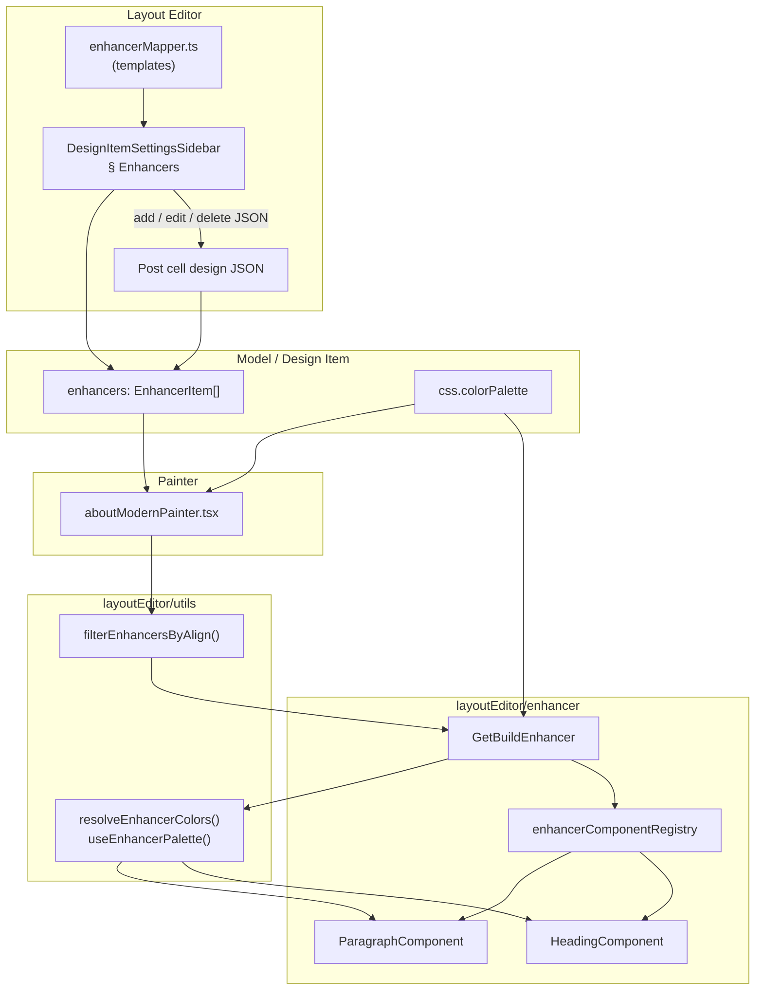
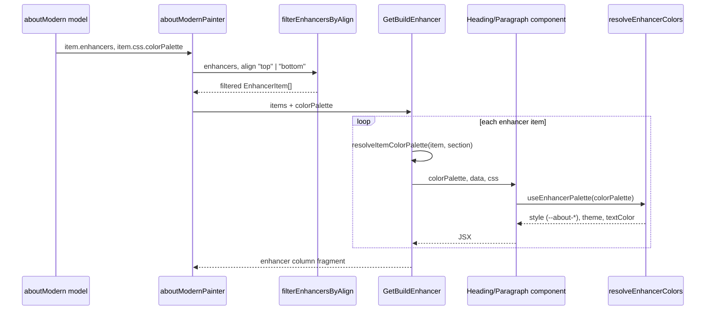
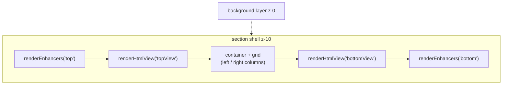
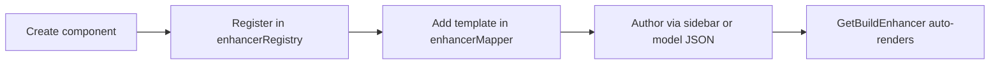

# Enhancer System — Integration & Architecture Guide

This document describes the **Enhancer** system: typed, palette-aware UI blocks attached to design items (e.g. headings and paragraphs above/below section content). It covers data shape, layout-editor authoring, painter integration, color palette reactivity, and how to add new enhancer types.

**Primary reference painter:** `src/drafting/painter/about/aboutModernPainter.tsx`  
**Primary model example:** `aboutModern` in `src/drafting/modelData/about.ts`  
**Runtime entry point:** `src/drafting/layoutEditor/enhancer/index.tsx` (`GetBuildEnhancer`)

---

## Table of Contents

1. [Overview](#overview)
2. [Architecture](#architecture)
3. [Data model](#data-model)
4. [File structure](#file-structure)
5. [End-to-end flow](#end-to-end-flow)
6. [Layout editor (sidebar)](#layout-editor-sidebar)
7. [Painter integration](#painter-integration)
8. [Color palette & reactivity](#color-palette--reactivity)
9. [Adding a new enhancer type](#adding-a-new-enhancer-type)
10. [Comparison with mediaCells / GetBuildView](#comparison-with-mediaCells--getbuildview)
11. [Troubleshooting](#troubleshooting)
12. [Checklist](#checklist)

---

## Overview

Enhancers are **optional content blocks** stored on a design item as an `enhancers` array. Each item has:

| Field | Role |
|--------|------|
| `type` | Selects the React component (`heading`, `paragraph`, …) |
| `align` | Slot: `"top"` or `"bottom"` (filtered before render) |
| `data` | Type-specific payload (e.g. `text`) |
| `css` | Type-specific styling (`tailwind`, optional `colorKey`, optional per-item `colorPalette`) |

The system mirrors other drafting registries (backgrounds, animations, media views):

| Layer | Role |
|--------|------|
| **Templates** | `enhancerMapper.ts` — default JSON when adding from sidebar |
| **Registry** | `enhancerRegistry.tsx` — `type` → React component |
| **Builder** | `GetBuildEnhancer` — iterates items, passes props |
| **Utils** | `enhancerUtils.ts` — filter by align; `resolveEnhancerColors.ts` — palette → CSS vars |
| **Painter** | Reads `item.enhancers` + `item.css.colorPalette`, renders top/bottom slots |

**Current built-in types:** `heading`, `paragraph`  
**First integrated painter:** `aboutModernPainter` (alongside `mediaCells.topView` / `bottomView`)

---

## Architecture

### High-level diagram



### Render sequence (aboutModern)



### Slot layout in section shell



Enhancers sit **outside** the main grid, in the same vertical band as `mediaCells` top/bottom views.

---

## Data model

### Top-level field on design item

```typescript
// DraftDesignItem / model entry (e.g. aboutModern)
enhancers?: EnhancerItem[];
```

### Enhancer item shape

```json
[
  {
    "type": "paragraph",
    "align": "bottom",
    "data": {
      "text": "Lorem ipsum dolor sit amet..."
    },
    "css": {
      "tailwind": {
        "text": "text-[var(--about-textMuted,#4A5D73)] leading-relaxed"
      },
      "colorKey": "textMuted"
    }
  },
  {
    "type": "heading",
    "align": "top",
    "data": {
      "text": "Section heading"
    },
    "css": {
      "tailwind": {
        "text": "text-[var(--about-text,#1E2430)] font-bold"
      },
      "colorKey": "text"
    }
  }
]
```

### TypeScript types (`layoutEditor/utils/enhancerUtils.ts`)

```typescript
type EnhancerAlign = "top" | "bottom";

type EnhancerItem = {
  type: string;
  align?: EnhancerAlign | string;
  data?: Record<string, unknown>;
  css?: {
    tailwind?: Record<string, string>;
    colorPalette?: BackgroundColorPalette; // optional override
  };
};
```

### `align` behavior

| `align` value | Rendered in |
|---------------|-------------|
| `"top"` | Top slot (`renderEnhancers("top")`) |
| `"bottom"` | Bottom slot (`renderEnhancers("bottom")`) |
| missing / other | **Not rendered** (filtered out) |

Order within a slot matches array order after filtering.

### Relationship to `css.colorPalette`

Section-level palette lives on the design item:

```typescript
// aboutModern — src/drafting/modelData/about.ts
css: {
  colorPalette: {
    theme: "light",
    light: { primary: "#2A3F6D", text: "#1E2430", textMuted: "#4A5D73", ... },
    dark: { ... },
  },
  tailwind: { ... },
  typography: { ... },
}
```

Painters pass `css.colorPalette` into `GetBuildEnhancer`. Individual enhancer items may override with `css.colorPalette` on the item itself; otherwise the section palette is used.

---

## File structure

```
src/drafting/
├── modelData/
│   └── about.ts                    # aboutModern.enhancers + css.colorPalette
├── painter/about/
│   └── aboutModernPainter.tsx      # renderEnhancers(), passes colorPalette
└── layoutEditor/
    ├── enhancer/
    │   ├── index.tsx               # GetBuildEnhancer (default export)
    │   ├── types.ts                # EnhancerComponentProps
    │   ├── enhancerMapper.ts       # Sidebar templates (defaults)
    │   ├── enhancerRegistry.tsx    # type → component map
    │   └── components/
    │       ├── heading.tsx         # Heading-specific data/css + palette
    │       └── paragraph.tsx       # Paragraph-specific data/css + palette
    └── utils/
        ├── enhancerUtils.ts        # filterEnhancersByAlign, types
        └── resolveEnhancerColors.ts # palette → CSS vars, useEnhancerPalette hook
```

**Layout editor UI:** `DesignItemSettingsSidebar.tsx` — Enhancers section (JSON editor, add from template, edit/delete chips).

---

## End-to-end flow

1. **Model** — `aboutModern` (or any item) defines `enhancers[]` and `css.colorPalette`.
2. **Sidebar** — Author adds items from `enhancerMapper` keys or edits raw JSON; saves to `item.enhancers`.
3. **Painter** — Reads `item.enhancers` and `item.css.colorPalette`.
4. **Filter** — `filterEnhancersByAlign(enhancers, "top" | "bottom")`.
5. **Build** — `GetBuildEnhancer` maps each item to a component via `enhancerComponentRegistry`.
6. **Component** — `useEnhancerPalette(colorPalette)` applies theme + `--about-*` / `--enhancer-*` variables.
7. **DOM** — Wrapper `div` gets `style={palette.style}` and `data-theme={palette.theme}`; inner element uses `data.text` + `css.tailwind`.

---

## Layout editor (sidebar)

Located in **Design Item Settings → Enhancers** (`DesignItemSettingsSidebar.tsx`).

| Action | Behavior |
|--------|----------|
| **Select template** | Dropdown keys from `Object.keys(enhancerMapper)` |
| **Add** | Deep-clones template from `enhancerMapper[selectedKey]`, appends to array |
| **Edit** | JSON modal for single item |
| **Delete** | Removes item at index |
| **Raw JSON** | Full `enhancers` array textarea with validation |

Templates (`enhancerMapper.ts`) are **authoring defaults only**. Runtime rendering uses `enhancerComponentRegistry`, not the mapper object shape at render time (except that templates should match expected `type` / `data` / `css`).

---

## Painter integration

### Step 1 — Imports

```tsx
import GetBuildEnhancer, {
  filterEnhancersByAlign,
  type EnhancerAlign,
} from "../../layoutEditor/enhancer";
import { safeArray } from "../../utils/safeAccess";
```

### Step 2 — Read enhancers and palette

```tsx
const enhancers = safeArray<unknown>(
  (item as { enhancers?: unknown })?.enhancers,
);
const css = safeObject<Model["css"]>(item?.css);
const colorPalette = css?.colorPalette;
```

### Step 3 — Render helper

```tsx
const renderEnhancers = (align: EnhancerAlign) => {
  const items = filterEnhancersByAlign(enhancers, align);
  if (items.length === 0) return null;
  return <GetBuildEnhancer items={items} colorPalette={colorPalette} />;
};
```

### Step 4 — Place in layout shell

In `aboutModernPainter.tsx` (both `renderLayout` and `renderLayoutSingleColumn`):

```tsx
<div className="relative z-10">
  {renderEnhancers("top")}
  {renderHtmlView("topView")}

  <div className={finalCss?.container || ""}>
    {/* main grid */}
  </div>

  {renderHtmlView("bottomView")}
  {renderEnhancers("bottom")}
</div>
```

### Reference implementation

See `aboutModernPainter.tsx` lines ~118–175 (data + `renderEnhancers`) and ~857–909 (layout slots).

---

## Color palette & reactivity

### Why fingerprinting?

Editors often **mutate** `css.colorPalette` in place. React may not re-render if only nested color values change but the parent object reference stays the same. The enhancer stack solves this with:

1. **`getColorPaletteFingerprint(colorPalette)`** — Serializes `theme` + sorted color entries into a string.
2. **`useEnhancerPalette()`** — `useMemo` depends on `fingerprint`, not only object reference.
3. **`GetBuildEnhancer` keys** — `key` includes section + item fingerprints so children remount when palette content changes.

### CSS variables applied per enhancer wrapper

`resolveEnhancerColors()` writes inline styles:

| Variable | Source |
|----------|--------|
| `--about-{key}` | Active theme colors (matches painter section vars) |
| `--enhancer-{key}` | Same values (enhancer-scoped alias) |
| `color` | Resolved via `css.colorKey` + fallbacks |

### Per-component defaults

| Component | Default `colorKey` | Fallback chain |
|-----------|-------------------|----------------|
| `HeadingComponent` | `text` | `text`, `primary` |
| `ParagraphComponent` | `textMuted` | `textMuted`, `text` |

Override per item:

```json
"css": { "colorKey": "primary" }
```

### Tailwind classes and palette

Prefer **CSS variables** in `css.tailwind.text` so palette edits propagate:

```text
text-[var(--about-textMuted,#4A5D73)]
```

Avoid fixed utilities like `text-gray-600` on enhancers if you want live palette sync from `about.ts` / sidebar.

The section painter also sets `--about-*` on the `<section>` via `cssVariables` `useMemo`; enhancer wrappers duplicate those vars locally so each block stays correct even when reused outside a full about shell.

---

## Adding a new enhancer type

Example: adding `badge`.

### 1. Component (`enhancer/components/badge.tsx`)

```tsx
import React from "react";
import { createSafeTailwind, safeObject, safeString } from "../../../utils/safeAccess";
import type { EnhancerComponentProps } from "../types";
import { useEnhancerPalette } from "../../utils/resolveEnhancerColors";

export type BadgeEnhancerData = { label?: string };
export type BadgeEnhancerCss = {
  tailwind?: { wrapper?: string; text?: string };
  colorKey?: string;
};

const BADGE_FALLBACKS = ["accent", "primary"] as const;

export const BadgeComponent: React.FC<EnhancerComponentProps> = ({
  colorPalette,
  data: rawData,
  css: rawCss,
}) => {
  const data = safeObject<BadgeEnhancerData>(rawData);
  const css = safeObject<BadgeEnhancerCss>(rawCss);
  const label = safeString(data.label);
  if (!label) return null;

  const tailwind = createSafeTailwind(css.tailwind);
  const palette = useEnhancerPalette(colorPalette, {
    colorKey: css.colorKey ?? "accent",
    fallbacks: BADGE_FALLBACKS,
  });

  return (
    <div className={tailwind.wrapper || ""} style={palette.style} data-theme={palette.theme}>
      <span className={tailwind.text || "text-[var(--about-accent)]"}>{label}</span>
    </div>
  );
};
```

### 2. Register component (`enhancerRegistry.tsx`)

```tsx
import { BadgeComponent } from "./components/badge";

export const enhancerComponentRegistry = {
  heading: HeadingComponent,
  paragraph: ParagraphComponent,
  badge: BadgeComponent,
};
```

### 3. Add sidebar template (`enhancerMapper.ts`)

```ts
badge: {
  type: "badge",
  align: "top",
  data: { label: "New" },
  css: {
    tailwind: { text: "text-[var(--about-accent,#6B8BBE)] text-sm font-semibold" },
  },
},
```

### 4. Model data (optional)

Append to `enhancers` in the target model JSON in `modelData/*.ts`.

### 5. Painter

No change required if the painter already calls `renderEnhancers` — new types work once registered.



---

## Comparison with mediaCells / GetBuildView

| Aspect | `mediaCells` + `GetBuildView` | `enhancers` + `GetBuildEnhancer` |
|--------|------------------------------|----------------------------------|
| Purpose | HTML / markdown / cell media | Typed React UI blocks |
| Slot keys | `topView`, `bottomView`, … | `align`: `top` / `bottom` |
| Content | `mediaType`, `mediaLink` | `type`, `data`, `css` |
| Registry | Media pipeline | `enhancerComponentRegistry` |
| Palette | `markdownColorPalette` | `colorPalette` + `useEnhancerPalette` |
| Editor templates | N/A (free-form views) | `enhancerMapper` |

Both can be used **together** on the same section (see `aboutModern`).

---

## Troubleshooting

| Symptom | Likely cause | Fix |
|---------|----------------|-----|
| Enhancer not visible | Wrong/missing `align` | Set `"top"` or `"bottom"` |
| Unknown type not rendered | Type not in registry | Add component + `enhancerComponentRegistry` entry |
| Colors don’t update in editor | Hardcoded Tailwind grays | Use `var(--about-*)` in `css.tailwind` |
| Colors don’t update (palette) | Stale React memo | Ensure `useEnhancerPalette` / fingerprint keys are used |
| Empty output | Missing `data.text` (or required field) | Components return `null` when required data is empty |
| Item palette ignored | Invalid `css.colorPalette` on item | Must be object; else section palette is used |

---

## Checklist

### Integrate enhancers into a new painter

- [ ] Model defines `enhancers?: EnhancerItem[]` (can default to `[]`)
- [ ] Model defines `css.colorPalette` (or pass `undefined`)
- [ ] Import `GetBuildEnhancer`, `filterEnhancersByAlign`
- [ ] Implement `renderEnhancers("top" | "bottom")`
- [ ] Place top/bottom slots in section layout next to optional `mediaCells` views
- [ ] Pass `colorPalette` from `item.css`

### Add a new enhancer type

- [ ] Create `components/<type>.tsx` with own `data` / `css` types
- [ ] Use `useEnhancerPalette` with appropriate `colorKey` / fallbacks
- [ ] Register in `enhancerRegistry.tsx`
- [ ] Add template in `enhancerMapper.ts`
- [ ] Use palette-aware Tailwind (`var(--about-*)`) in templates and model samples

### Authoring in layout editor

- [ ] Open design item → Enhancers section
- [ ] Pick template key → Add, or edit JSON directly
- [ ] Set `align` to `top` or `bottom`
- [ ] Save cell / apply update

---

## Related documentation

| Document | Relevance |
|----------|-----------|
| `src/doc/BACKGROUND_STUDIO_INTEGRATION.md` | Same registry + painter pattern; `css.colorPalette` |
| `src/doc/ABOUT_PAINTER_PATTERN.md` | Section layout, `mediaCells`, type-driven renderers |
| `src/doc/MODELDATA_STANDARDIZATION.md` | Model field conventions |
| `src/doc/THEME_DOCUMENTATION.md` | Global theme tokens |

---

## Quick reference — key exports

| Export | Module |
|--------|--------|
| `default` `GetBuildEnhancer` | `layoutEditor/enhancer/index.tsx` |
| `filterEnhancersByAlign` | `layoutEditor/enhancer/index.tsx` |
| `enhancerComponentRegistry` | `layoutEditor/enhancer/enhancerRegistry.tsx` |
| `enhancerMapper` | `layoutEditor/enhancer/enhancerMapper.ts` |
| `useEnhancerPalette` | `layoutEditor/utils/resolveEnhancerColors.ts` |
| `getColorPaletteFingerprint` | `layoutEditor/utils/resolveEnhancerColors.ts` |
