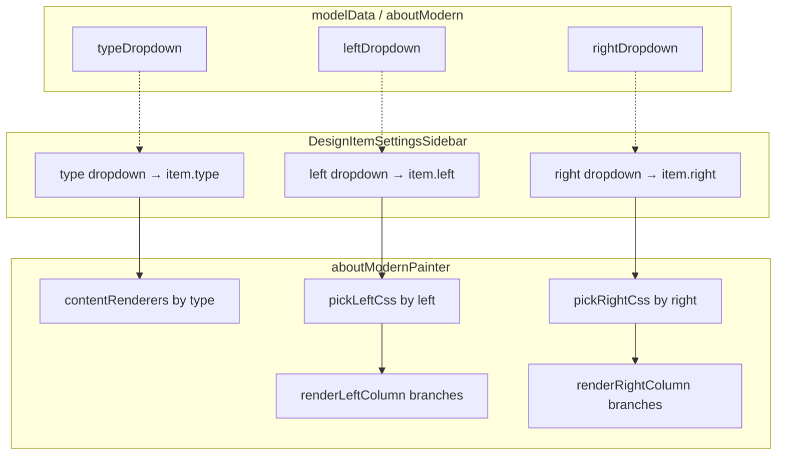

# ModelData Standardization Documentation

## Overview

This document describes the **standardized data structure** for ALL component objects in the `src/drafting/modelData/` folder. The canonical reference is **`about.ts`** — specifically the **`aboutModern`** export (from line 748). Every component object MUST follow this structure.

**Latest reference for multi-variant columns:** `aboutModern` lines **750–755** (`type`, `left`, `right`, dropdown arrays) plus `css.tailwind` keys suffixed `Type2`…`Type6` and painter helpers `pickLeftCss` / `pickRightCss` in `aboutModernPainter.tsx`.

**Painter reference:** `src/drafting/painter/about/aboutModernPainter.tsx` — consumes this model; see `POST_CELL_MODIFICATION.md` for execution details.

**Chunk-by-chunk guide:** See [Chunk execution map](#chunk-execution-map-model-json--painter--runtime) below and `POST_CELL_MODIFICATION.md` §23–§24 for line-by-line painter blocks and clone steps.

**CSS two-layer system (878–1010):** See [§4.7](#47-two-layer-css-tokens-lines-878960--tailwind-lines-9611010) for exact mapping of `colorPalette`, `typography`, `borders`, `layout` → `tailwind`, plus **theme**, **responsive**, **hover**, **Framer Motion**, **null safety**, and **clickable buttons**.

---

## Top-level keys (required shape)

Every standardized component object MUST include these keys in order:

| Key | Required | Description |
|-----|----------|-------------|
| `id` | yes | PascalCase identifier (e.g. `"AboutModern"`) |
| `type` | yes | **Section shell** variant — grid order / single-column (e.g. `"Type1"`) |
| `typeDropdown` | yes | Allowed **section shell** options |
| `left` | optional* | **Left column** internal layout variant (e.g. `"Type3"`) |
| `leftDropdown` | optional* | Allowed left column options |
| `right` | optional* | **Right column** internal layout variant (e.g. `"Type4"`) |
| `rightDropdown` | optional* | Allowed right column options |
| `data` | yes | Content JSON (header, media, statistics, cta, optional HTML fields) |

\*Required when the component painter implements independent left/right column variants (see [§13](#13-left-and-right-column-variants-aboutmodern)).
| `mediaCells` | yes | Slot-based HTML / cell / preview content (replaces legacy `mediaCells`) |
| `css` | yes | Theme, typography, borders, layout, tailwind, antd, mui, customCss |
| `background` | optional | Decorative background (e.g. `FloatingBlobs`) |
| `enhancers` | optional | Paragraph / heading blocks above or below section |
| `settings` | yes | Animations, interactions, reducedMotion, overlays |
| `checkboxes` | yes | Visibility toggles (`isPostCellVisible`, `isListVisible`, …) |
| `list` | yes | Standard list scaffold |
| `wrapper` | yes | Array (usually `[]`) |
| `animations` | yes | Array (usually `[]`) |

```typescript
export const aboutModern = {
  id: "AboutModern",
  type: "Type1",           // section shell: 2-col order / stacked
  left: "Type1",           // left column internal layout
  right: "Type1",          // right column internal layout
  typeDropdown: ["Type1", "Type2", "Type3", "Type4"],
  leftDropdown: ["Type1", "Type2", "Type3", "Type4", "Type5", "Type6"],
  rightDropdown: ["Type1", "Type2", "Type3", "Type4", "Type5", "Type6"],
  data: { /* … */ },
  mediaCells: { /* … */ },
  css: { /* … */ },
  background: { /* … */ },
  enhancers: [ /* … */ ],
  settings: { /* … */ },
  checkboxes: { isPostCellVisible: true, isListVisible: true },
  list: { type: "row", settings: {}, css: { tailwind: { global: "", item: "" } }, items: [] },
  wrapper: [],
    animations: [],
  hints:{}
};
```

> **CSS rule:** All styling lives in the model `css` object (and per-enhancer `css`). Painters MUST NOT hardcode Tailwind class strings or hex colors — they only read `createSafeTailwind(css.tailwind)` and emit CSS variables from `css.colorPalette`, `css.typography`, `css.borders`, and `css.layout`.

---

## 1. Identity & Type

| Property        | Type     | Description |
|----------------|----------|-------------|
| `id`           | `string` | Unique identifier; **PascalCase** matching the component name (e.g. `"AboutModern"`). |
| `type`         | `string` | Current **section shell** variant (grid / column order). |
| `typeDropdown` | `string[]` | Allowed **section shell** options. |
| `left`         | `string` | Current **left column** internal layout (independent of `type`). |
| `leftDropdown` | `string[]` | Allowed left column layout options. |
| `right`        | `string` | Current **right column** internal layout (independent of `type`). |
| `rightDropdown`| `string[]` | Allowed right column layout options. |

### 1.1 Canonical `aboutModern` selectors (lines 750–755)

```typescript
// src/drafting/modelData/about.ts — aboutModern
type: "Type1",
left: "Type1",
right: "Type1",
typeDropdown: ["Type1", "Type2", "Type3", "Type4"],
leftDropdown: ["Type1", "Type2", "Type3", "Type4", "Type5", "Type6"],
rightDropdown: ["Type1", "Type2", "Type3", "Type4", "Type5", "Type6"],
```

### 1.2 Three-axis layout system — do not confuse the three keys

| Axis | Model key | Dropdown key | Controls | Painter reads | Editor UI label |
|------|-----------|--------------|----------|---------------|-----------------|
| **Section shell** | `type` | `typeDropdown` | Two-column vs single-column; **which column is first** | `item.type` → `contentRenderers` | **Type** |
| **Left column** | `left` | `leftDropdown` | Typography, features, stats strip, CTA styling inside left column | `item.left` → `pickLeftCss`, `renderLeftColumn` branches | **Left** |
| **Right column** | `right` | `rightDropdown` | Image frame, services panel, overlay, stats card inside right column | `item.right` → `pickRightCss`, `renderRightColumn` branches | **Right** |

**Important:** `type` and `left` / `right` are **orthogonal**. Example: `type: "Type1"` (left then right in 2-col grid) + `left: "Type6"` (monograph timeline) + `right: "Type5"` (salon portrait) is valid — **6 × 6 × 4 = 144** visual combinations for `aboutModern` (4 section shells × 6 left × 6 right).



### 1.3 What each `type` value does (section shell only)

| `type` | Grid class | Column order |
|--------|------------|--------------|
| Type1 | `css.tailwind.grid` | Left, then Right |
| Type2 | `css.tailwind.grid` | Right, then Left |
| Type3 | `css.tailwind.gridSingleColumn` | Left, then Right (stacked) |
| Type4 | `css.tailwind.gridSingleColumn` | Right, then Left (stacked) |

Painter: `contentRenderers` in `aboutModernPainter.tsx` — **does not** change feature card or image layout; only shell + order.

### 1.4 What `left` / `right` values do (column internals)

Documented in full in [§13](#13-left-and-right-column-variants-aboutmodern). Summary:

- **Left Type1–Type6:** different intro blocks, feature list geometry, stats highlights, CTA chrome.
- **Right Type1–Type6:** different image/services/stats composition (absolute overlay, split grid, frame, glass hero, salon portrait, classical diptych).

`leftDropdown` / `rightDropdown` may list **more** types than `typeDropdown` (e.g. six column variants but only four section shells).

---

## 2. Data (JSON object)

`data` holds **component-specific content** as a JSON object. Structure varies by component; the About pattern includes:

- **header**: `title`, `titleHighlight`, `subtitle`, `description`, **features** (array of `{ title, description, icon }`).
- **media**: `main` and `overlay`, each with nested `media: { mediaLink, mediaType, alt? }`.
- **statistics**: array of `{ count, label }`.
- **cta**: `primary` (and optionally `secondary`) with `text`, `link`, `clickType`, **icon** (see §8).

All user-facing copy, links, and media URLs live here. **Icons** inside `data` (e.g. in features or cta) MUST use the **Material UI icon format** (see §8).

### 2.1 header.features

```typescript
features: [
  {
    title: "Global Reach",
    description: "Worldwide logistics network spanning 150+ countries",
    icon: {
      iconName: "Public",
      type: "Filled",
      fontSize: "medium",
    },
  },
],
```

### 2.2 media

Supported `mediaType` values (via `renderMedia`): `image`, `gif`, `youtube`, `mp4`, `iframe`, `audio`, **`html`**, **`markdown`**, **`preview`**, `cell`.

```typescript
media: {
  main: {
    media: {
      mediaLink: "https://...",
      mediaType: "image",
      alt: "Logistics worker with clipboard",
    },
  },
  overlay: {
    media: {
      mediaLink: "https://...",
      mediaType: "image",
    },
  },
},
```

### 2.3 statistics & cta

```typescript
statistics: [{ count: "15,350+", label: "Clients Worldwide" }],
cta: {
  primary: {
    text: "More About Us",
    link: "/about",
    clickType: "href",   // "", "href", "modal", "dialog", "transition", "link"
    icon: { iconName: "ArrowForward", type: "Filled", fontSize: "medium" },
  },
},
```

**All CTA buttons MUST be clickable.** Set `clickType` and `link` appropriately:

| `clickType` | Behavior |
|-------------|----------|
| `"href"` | Native navigation (`<motion.a href={link}>`) |
| `"modal"` | Opens modal overlay (content from `link`) |
| `"dialog"` | Opens centered dialog |
| `"transition"` | Full-page transition (early return in painter) |
| `"link"` | External / custom link handler |
| `""` | Falls back to `"href"` via painter default |

Modal/dialog styling comes from `settings.overlays.tailwind` — not from the painter.

### 2.4 HTML & preview fields in `data` (optional)

Use **`mediaType: "html"`** when a data slot should render raw HTML (via `HtmlRenderer` / `renderMedia`):

```typescript
// Example: rich HTML block inside data (component-specific key)
htmlContent: {
  media: {
    mediaType: "html",
    mediaLink: "<p class='text-[var(--about-textMuted,#4A5D73)]'>Custom <strong>HTML</strong> block</p>",
  },
},
```

Use **`mediaType: "preview"`** for URL link-preview cards (fetches metadata via `LinkMetadataPreview`):

```typescript
linkPreview: {
  media: {
    mediaType: "preview",
    mediaLink: "https://example.com/article",
  },
},
```

**Tags / mentions in JSON:** When storing HTML strings in `data` or `mediaCells`, use standard HTML tags (`<p>`, `<span>`, `<strong>`, `<a>`, etc.) inside `mediaLink`. Prefer theme CSS variables (`var(--about-textMuted,#4A5D73)`) over hardcoded colors so light/dark themes stay consistent.

---

## 3. mediaCells (slot-based HTML / cell content)

> **Rename:** Legacy key **`mediaCells`** is deprecated. New and migrated components MUST use **`mediaCells`**. The painter reads `item.mediaCells` (see `aboutModernPainter.tsx`).

`mediaCells` stores **per-slot content** as arrays of media items. Each item uses the unified media pipeline (`GetBuildView` → `renderMedia`).

### 3.1 Item types

| `mediaType` | `mediaLink` | Purpose |
|-------------|-------------|---------|
| `"html"` | HTML string | Inline HTML (Tailwind + CSS vars allowed) |
| `"cell"` | URL or `""` | Post-cell embed; empty string = placeholder |
| `"preview"` | URL | Link metadata preview card |
| `"markdown"` | Markdown string | Themed markdown block |

Legacy shape (still resolved by `GetBuildView`, do not use in new data):

- `{ type: "html", htmlView: "..." }` → migrate to `{ mediaType: "html", mediaLink: "..." }`
- `{ type: "cellLink", link: "..." }` → migrate to `{ mediaType: "cell", mediaLink: "..." }`

### 3.2 Required slots

| Slot             | Typical content |
|------------------|-----------------|
| `topView`        | `[html, cell]` |
| `bottomView`     | `[html, cell]` |
| `leftTopView`    | `[html]` |
| `leftBottomView` | `[html]` |
| `rightTopView`   | `[html]` |
| `rightBottomView`| `[html]` |
| `insertView`     | `[html, cell]` — left column, after description, before features |

### 3.3 Example

```typescript
mediaCells: {
  topView: [
    {
      mediaType: "html",
      mediaLink:
        "<p class='text-left text-base leading-relaxed text-[var(--about-textMuted,#4A5D73)]'>Trusted by industry leaders for <span class='font-semibold text-[var(--about-text,#1E2430)]'>reliable logistics</span> and end-to-end supply chain excellence.</p>",
    },
    { mediaType: "cell", mediaLink: "" },
  ],
  bottomView: [
    { mediaType: "html", mediaLink: "..." },
    { mediaType: "cell", mediaLink: "" },
  ],
  leftTopView: [{ mediaType: "html", mediaLink: "..." }],
  leftBottomView: [{ mediaType: "html", mediaLink: "..." }],
  rightTopView: [{ mediaType: "html", mediaLink: "..." }],
  rightBottomView: [{ mediaType: "html", mediaLink: "..." }],
  insertView: [
    { mediaType: "html", mediaLink: "..." },
    { mediaType: "cell", mediaLink: "" },
  ],
},
```

### 3.4 Testing workflow — remove placeholder HTML after verification

During development, populate `mediaCells` slots with sample `mediaType: "html"` blocks to verify placement, theme variables, and responsive behavior in the layout editor.

**After testing is complete:**

1. Remove temporary / duplicate HTML items from each slot (or set slots to `[]` / `{ mediaType: "cell", mediaLink: "" }` only).
2. Do **not** ship placeholder lorem HTML in production model JSON.
3. Keep the slot keys present (even as empty arrays) so the editor and painter contract stay stable.

---

## 4. CSS (theme, typography, borders, layout, tailwind)

`css` MUST include the following sub-objects. Tailwind classes SHOULD use CSS variables (e.g. `var(--about-primary,#2A3F6D)`) with fallbacks. The painter resolves `colorPalette`, `typography`, `borders`, and `layout` into inline CSS variables on `<section style={cssVariables}>` — it does **not** define visual styling itself.

### 4.1 colorPalette (theme)

- **theme**: `"light"` | `"dark"` (default active theme).
- **light** and **dark**: each with:
  - `primary`, `primaryDark`, `accent`
  - `background`, `backgroundAlt`, `surface`, `border`
  - `text`, `textMuted`, `onPrimary`

Painter emits `--about-primary`, `--about-text`, etc., and sets `data-theme={themeMode}` on the section.

### 4.2 typography

- **fontFamily**: `sans`, `serif` (string values).
- **standard**:
  - **fontSize**: xs, sm, base, lg, xl, 2xl, 3xl, 4xl, 5xl, title (e.g. rem).
  - **lineHeight**: tight, normal, relaxed.
  - **letterSpacing**: wider, widest.

Painter emits `--about-fontFamily-sans`, `--about-fontSize-lg`, `--about-lineHeight-relaxed`, etc.

### 4.3 borders (corner radius)

Section-level border/radius. Values: Tailwind-style names (`"lg"`, `"2xl"`, `"full"`) or directional (e.g. `"t-lg"`, `"tl-xl"`, `"tr-2xl"`, `"bl-md"`, `"br-full"`).

Painter resolves to per-corner CSS variables: `--about-radius-{section}-{tl|tr|br|bl}`.

```typescript
borders: {
  features: "lg",
  quoteCard: "2xl",
  descriptionCard: "2xl",
  cta: "xl",
  statistics: "2xl",
  statsPattern: "full",
  frameDesign: "2xl",
  cornerElement: "full",
  mainImage: "xl",
  overlayImage: "xl",
  floatingAccent: "full",
},
```

Tailwind in model references them:

```text
rounded-tl-[var(--about-radius-features-tl,0.5rem)]
```

### 4.4 layout

Section-level spacing (padding, margin, gap, width, height). Values: Tailwind spacing numbers (e.g. `"4"`, `"6"`, `"8"`) or CSS (e.g. `"1rem"`, `"1.5rem"`).

Painter emits `--about-layout-{section}-{key}` (e.g. `--about-layout-container-paddingX`).

### 4.5 tailwind

String values for each UI region. Use CSS variables with fallbacks for colors, typography, borders, and layout.

**Responsive:** Use Tailwind breakpoint prefixes (`sm:`, `md:`, `lg:`) in these strings — responsiveness is driven entirely from model `css.tailwind` and `css.layout`, not from painter code.

Common keys (About): `global`, `container`, `grid`, `gridSingleColumn`, `leftColumn`, `title`, `mainTitle`, `highlightTitle`, `subtitle`, `description`, `featuresContainer`, `featureItem`, `featureIcon`, `featureContent`, `featureTitle`, `featureDescription`, `ctaContainer`, `ctaButton`, `ctaArrow`, `rightColumn`, `imageContainer`, `mainImage`, `image`, `overlayImage`, `overlayImageZ`, `statsCard`, `statsCount`, `statsLabel`.

**Hover effects:** Define hover/active/group-hover classes here (e.g. `hover:border-[var(--about-primary)]/40`, `group-hover:text-[var(--about-primary)]`). Painters apply Framer `whileHover` for motion; visual hover styling belongs in `css.tailwind`.

### 4.6 antd, mui, customCss

- **antd**: `{}` (or Ant Design overrides).
- **mui**: `{}` (or MUI overrides).
- **customCss**: `{}` (or custom rules).

```typescript
css: {
  colorPalette: { ... },
  typography: { ... },
  borders: { ... },
  layout: { ... },
  tailwind: { ... },
  antd: {},
  mui: {},
  customCss: {},
},
```

### 4.7 Two-layer CSS: tokens (lines 878–960) → tailwind (lines 961–1010)

`aboutModern` uses a **two-layer CSS system**. Layer 1 defines **design tokens**; Layer 2 defines **Tailwind class strings** that consume those tokens. The painter sits in the middle and **only converts Layer 1 to CSS variables** — it never hardcodes Layer 2.

```
┌─────────────────────────────────────────────────────────────────┐
│  LAYER 1 — css tokens (about.ts ~878–960)                       │
│  colorPalette │ typography │ borders │ layout                   │
└───────────────────────────┬─────────────────────────────────────┘
                            │  aboutModernPainter cssVariables useMemo
                            │  → style={{ "--about-primary": "#2A3F6D", … }}
                            ▼
┌─────────────────────────────────────────────────────────────────┐
│  <section style={cssVariables} data-theme="light|dark">         │
└───────────────────────────┬─────────────────────────────────────┘
                            │  className={finalCss?.title} etc.
                            ▼
┌─────────────────────────────────────────────────────────────────┐
│  LAYER 2 — css.tailwind (about.ts ~961–1010)                    │
│  "text-[var(--about-text,#1E2430)] md:text-[var(--about-…)]"    │
└─────────────────────────────────────────────────────────────────┘
```

**Rule when cloning:** Change token values in Layer 1 **and** update fallbacks in Layer 2 (`#2A3F6D` after comma). Replace prefix `about` → `hero` in **both** layers + painter useMemo.

---

#### 4.7.1 Theme — `colorPalette` (878–904) → tailwind color usage

**Model (`colorPalette.theme` + `light` / `dark`):**

| Token key | Light value (aboutModern) | CSS variable emitted | Used in tailwind key |
|-----------|---------------------------|----------------------|----------------------|
| `theme` | `"light"` | `data-theme="light"` on `<section>` | Switches which palette object painter reads |
| `primary` | `#2A3F6D` | `--about-primary` | `highlightTitle`, `featureItem` hover border, `ctaButton` border/text/hover bg, `statsCard` bg |
| `primaryDark` | `#1E2430` | `--about-primaryDark` | Available for custom keys |
| `accent` | `#6B8BBE` | `--about-accent` | `background.settings[].colorKey` |
| `background` | `#F6F5F1` | `--about-background` | `global` → `bg-[var(--about-background,#F6F5F1)]` |
| `backgroundAlt` | `#EFEDE6` | `--about-backgroundAlt` | `featureItem` → `hover:bg-[var(--about-backgroundAlt)]/30` |
| `surface` | `#FFFFFF` | `--about-surface` | `featureItem` bg, `overlayImage` border |
| `border` | `#C9CED6` | `--about-border` | `featureItem`, `mainImage` borders |
| `text` | `#1E2430` | `--about-text` | `title`, `mainTitle`, `featureTitle` |
| `textMuted` | `#4A5D73` | `--about-textMuted` | `subtitle`, `description`, `featureDescription` |
| `onPrimary` | `#F6F5F1` | `--about-onPrimary` | `statsCard` text, `ctaButton` hover text, CTA icon color in painter |

**Dark theme:** Same keys under `colorPalette.dark` (e.g. `primary: "#93C5FD"`). When `theme: "dark"`, painter emits dark values into the same `--about-*` variable names — tailwind strings **do not change**; they automatically pick up new values.

**Example chain (highlight title):**

```
colorPalette.light.primary = "#2A3F6D"
  → painter: --about-primary: #2A3F6D
  → tailwind.highlightTitle: "… text-[var(--about-primary,#2A3F6D)] …"
  → finalCss.highlightTitle on <span>
```

---

#### 4.7.2 Typography (905–926) → tailwind text usage

| Token path | Example value | CSS variable | tailwind key(s) using it |
|------------|---------------|--------------|--------------------------|
| `fontFamily.sans` | system stack | `--about-fontFamily-sans` | `global` → `[font-family:var(--about-fontFamily-sans)]` |
| `fontFamily.serif` | Georgia, … | `--about-fontFamily-serif` | enhancers only in aboutModern |
| `standard.fontSize.3xl` | `1.875rem` | `--about-fontSize-3xl` | `title` (base), `statsCount` |
| `standard.fontSize.4xl` | `2.25rem` | `--about-fontSize-4xl` | `title` → `md:text-[var(--about-fontSize-4xl,…)]` |
| `standard.fontSize.5xl` | `3rem` | `--about-fontSize-5xl` | `title` → `lg:text-[var(--about-fontSize-5xl,…)]` |
| `standard.fontSize.lg` | `1.125rem` | `--about-fontSize-lg` | `subtitle`, `description`, `featureTitle` |
| `standard.fontSize.sm` | `0.875rem` | `--about-fontSize-sm` | `featureDescription`, `statsLabel` |
| `standard.fontSize.base` | `1rem` | `--about-fontSize-base` | `ctaButton` |
| `standard.lineHeight.tight` | `1.25` | `--about-lineHeight-tight` | `title` |
| `standard.lineHeight.relaxed` | `1.75` | `--about-lineHeight-relaxed` | `subtitle`, `description`, `featureDescription` |
| `standard.letterSpacing.wider` | `0.05em` | `--about-letterSpacing-wider` | `ctaButton`, `statsLabel` → `tracking-[var(…)]` |

**Responsive typography example (`tailwind.title`):**

```text
text-[var(--about-fontSize-3xl,1.875rem)]
md:text-[var(--about-fontSize-4xl,2.25rem)]
lg:text-[var(--about-fontSize-5xl,3rem)]
```

Change sizes in **`typography.standard.fontSize`** — tailwind picks them up via vars. Breakpoint **prefixes** (`md:`, `lg:`) stay in **`tailwind.title`**.

---

#### 4.7.3 Borders (927–939) → tailwind rounded corners

| borders key | Token value | Resolved CSS var(s) | tailwind key using var |
|-------------|-------------|---------------------|------------------------|
| `features` | `"lg"` → `0.5rem` | `--about-radius-features-tl/tr/br/bl` | `featureItem` → `rounded-tl-[var(--about-radius-features-tl,0.5rem)]` × 4 corners |
| `cta` | `"xl"` → `0.75rem` | `--about-radius-cta-*` | `ctaButton` rounded classes |
| `mainImage` | `"xl"` | `--about-radius-mainImage-*` | `mainImage` |
| `overlayImage` | `"xl"` | `--about-radius-overlayImage-*` | `overlayImage` |
| `statistics` | `"2xl"` → `1rem` | `--about-radius-statistics-*` | `statsCard` |

**Execution:** Painter reads `borders.features: "lg"`, runs `resolveRoundedValue("lg")` → `0.5rem`, sets four corner vars. Tailwind `featureItem` string references those vars — **change corner shape in `borders` only**, not in tailwind rem values.

Directional tokens (e.g. `"t-lg"`) only set top-left + top-right vars — use when a component needs partial rounding.

---

#### 4.7.4 Layout (940–960) → tailwind spacing

| layout path | Token value | Painter converts to | tailwind reference |
|-------------|-------------|---------------------|-------------------|
| `container.paddingX` | `"6"` | `--about-layout-container-paddingX: 1.5rem` | `container` → `px-[var(--about-layout-container-paddingX,1.5rem)]` |
| `container.paddingXSm` | `"8"` | `…paddingXSm: 2rem` | `container` → `sm:px-[var(…,2rem)]` |
| `container.paddingY` | `"16"` | `…paddingY: 4rem` | `container` → `py-[var(…,4rem)]` |
| `container.paddingYMd` | `"24"` | `…paddingYMd: 6rem` | `container` → `md:py-[var(…,6rem)]` |
| `title.marginBottom` | `"3"` | `…title-marginBottom: 0.75rem` | `title` → `mb-[var(…,0.75rem)]` |
| `featuresContainer.marginTop` | `"8"` | `…featuresContainer-marginTop: 2rem` | `featuresContainer` → `mt-[var(…)]` |
| `featuresContainer.gap` | `"4"` | `…featuresContainer-gap: 1rem` | `featuresContainer` → `space-y-[var(…)]` |
| `grid.gap` | `"12"` | `…grid-gap: 3rem` | `grid`, `gridSingleColumn` |
| `grid.gapLg` | `"20"` | `…grid-gapLg: 5rem` | `grid` → `lg:gap-[var(…,5rem)]` |
| `leftColumn.gap` | `"6"` | `…leftColumn-gap: 1.5rem` | `leftColumn` → `space-y-[var(…)]` |
| `ctaContainer.paddingTop` | `"4"` | `…ctaContainer-paddingTop: 1rem` | `ctaContainer` |
| `ctaButton.gap` | `"2"` | `…ctaButton-gap: 0.5rem` | `ctaButton` → `gap-[var(…)]` |
| `imageContainer.marginBottom` | `"8"` | `…imageContainer-marginBottom: 2rem` | `imageContainer` |
| `mainImage.height` | `"80"` | `…mainImage-height: 20rem` | Used if wired; `mainImage` also has `h-80` in tailwind |
| `statsCard.padding` | `"5"` | `…statsCard-padding: 1.25rem` | `statsCard` → `p-[var(…)]` |

**Formula:** layout number `"N"` → `N × 0.25rem` (Tailwind spacing scale). Non-numeric strings pass through unchanged.

---

#### 4.7.5 Responsive — where it lives and how it runs

Responsive behavior is **100% in `css.tailwind` strings** (961–1010). The painter does not use `window.innerWidth` or media queries in JS.

| tailwind key | Responsive classes (aboutModern) | Effect |
|--------------|----------------------------------|--------|
| `container` | `sm:px-[…]`, `md:py-[…]` | Wider horizontal padding + taller vertical padding on larger screens |
| `grid` | `grid-cols-1 lg:grid-cols-2`, `lg:gap-[…]` | Single column mobile → two columns desktop |
| `gridSingleColumn` | `md:w-[80%] lg:w-[60%] mx-auto` | Type3/4: centered narrower column |
| `title` | `md:text-[…] lg:text-[…]` | Title scales up at breakpoints |

**Clone rule:** Copy breakpoint pattern from `aboutModern`; adjust width percentages in `gridSingleColumn` for your design.

---

#### 4.7.6 Hover effects — tailwind (visual) vs Framer (motion)

Hover is **split across two places** — both must be implemented when cloning:

| Component | Visual hover — **`css.tailwind`** (model) | Motion hover — **painter Framer** |
|-----------|-------------------------------------------|-----------------------------------|
| Feature card | `featureItem`: `hover:border-[var(--about-primary)]/40`, `hover:bg-[var(--about-backgroundAlt)]/30`, `transition-all duration-300` | `whileHover: { x: 4 }` on feature `motion.div` |
| Feature title | `featureTitle`: `group-hover:text-[var(--about-primary)]` (needs `group` on parent) | — |
| CTA button | `ctaButton`: `hover:bg-[var(--about-primary)]`, `hover:text-[var(--about-onPrimary)]` | `whileHover: { scale: 1.05, boxShadow: "…" }`, `whileTap: { scale: 0.98 }` |
| Main image | — | `whileHover: { scale: 1.05 }` (non-flow media only) |
| Stats card | — | `whileHover: { scale: 1.05, y: -5 }` |

**`settings.interactions.hover: true`** documents that hover is enabled. Visual classes **must** be in tailwind; Framer handles transform-only effects.

When **`useReducedMotion()`** is true: Framer hover is disabled; CSS `:hover` in tailwind may still apply unless you add `motion-reduce:` variants.

---

#### 4.7.7 Framer Motion animation — painter execution

Framer is configured in **`aboutModernPainter.tsx`**, not in model JSON. Model `settings.animations` documents intent only.

| Mechanism | Code | Behavior |
|-----------|------|----------|
| In-view trigger | `useInView(sectionRef, { once: true, amount: 0.1 })` | Animations start when 10% of section visible; run once |
| Reduced motion | `useReducedMotion()` + `settings.reducedMotion` | `reducedState = { opacity:1, x:0, … }`; transitions `duration: 0` |
| Left column | `initial: { opacity:0, x:-50 }` → `animate: { opacity:1, x:0 }` | Slides in from left when `isInView` |
| Right column | `initial: { opacity:0, x:50 }` → `animate: { opacity:1, x:0 }` | Slides in from right |
| Title | `y: 20 → 0`, delay `0.5s` | Staggered fade-up |
| Subtitle / description | fade, delays `0.6`, `0.7` | Sequential reveal |
| Features | container delay `0.8`; each item `0.9 + index * 0.1` | Staggered list |
| Overlay / stats | `scale: 0.8 → 1` | Pop-in on image stack |
| Section class | `motion-reduce` when reduced motion | Accessibility |

**Do not** put Framer props in model JSON. **Do** keep stagger delays consistent when cloning painter.

---

#### 4.7.8 Null safety — model gaps and painter guards

| Scenario | Painter handling | Result |
|----------|------------------|--------|
| `item.data` missing | `safeObject` → `{}` | No crash; columns may return null |
| `mediaCells.topView` missing | `getHtmlView` → `[]` | Slot not rendered |
| `css.tailwind.title` missing | `createSafeTailwind` → `""` | Element unstyled but visible |
| `css.colorPalette` missing | `cssVariables` → `undefined` | Fallback hex in tailwind strings still work |
| Left column all fields empty | `renderLeftColumn` returns `null` | No empty column wrapper |
| Right column no media/stat | `renderRightColumn` returns `null` | No empty column |
| Feature missing title+description | `.map` returns `null` for item | Skipped |
| `cta.primary` missing | `renderPrimaryCta` returns `null` | No button |
| `media.main.mediaLink` empty | `renderMediaSlot` returns `null` | Image block skipped |

**Clone rule:** Never use `item.data.header.title` without optional chaining; always use `safeObject` / `safeArray` at top of painter.

---

#### 4.7.9 Clickable buttons — `data.cta` + `settings.overlays`

**Model (`data.cta.primary`):**

```typescript
{
  text: "More About Us",
  link: "/about",           // URL or content id for modal/dialog/transition
  clickType: "href",        // "", "href", "modal", "dialog", "transition", "link"
  icon: { iconName: "ArrowForward", type: "Filled", fontSize: "medium" },
}
```

**Model (`settings.overlays`) — lines ~1075–1106:**

```typescript
overlays: {
  clickTypeOptions: ["", "href", "modal", "dialog", "transition", "link"],
  tailwind: {
    modal: { backdrop, scrim, container, panel, body, closeButton, closeIcon, content },
    dialog: { backdrop, scrim, container, closeButton, closeIcon, content },
  },
},
```

**Painter execution flow:**

```
User clicks CTA
  → onClick: handleClickType(event, ctaLink, clickType)
  → useLinkInteractions.handleClick
       clickType "href"     → navigate via <motion.a href> or default link behavior
       clickType "modal"    → renderModalContent() portal; styled via settings.overlays.tailwind.modal.*
       clickType "dialog"   → renderDialogContent(); styled via settings.overlays.tailwind.dialog.*
       clickType "transition" → isTransition true → painter early-returns transitionContent (full swap)
       clickType "link"     → custom/external handler
  → Modal/dialog JSX rendered inside <section> after main content
```

| clickType | Element | Styling source |
|-----------|---------|----------------|
| `href` | `<motion.a href={link}>` | `css.tailwind.ctaButton` |
| `modal` / `dialog` / `transition` / `link` | `<motion.button type="button">` | Button: `ctaButton`; overlay: `settings.overlays.tailwind` |

**Clone rule:** Copy full `settings.overlays` scaffold from `aboutModern`. Every new button (secondary CTA, feature links) must call `handleClickType` — never a no-op `onClick`.

---

#### 4.7.10 Full tailwind key → token dependency map (961–1010)

| tailwind key | Depends on (Layer 1 tokens) |
|--------------|----------------------------|
| `global` | `colorPalette.background`, `typography.fontFamily.sans` |
| `container` | `layout.container.*` |
| `grid` / `gridSingleColumn` | `layout.grid.gap`, `layout.grid.gapLg` |
| `leftColumn` | `layout.leftColumn.gap` |
| `title` | `fontSize.3xl/4xl/5xl`, `lineHeight.tight`, `colorPalette.text`, `layout.title.marginBottom` |
| `mainTitle` | `colorPalette.text` |
| `highlightTitle` | `colorPalette.primary` |
| `subtitle` / `description` | `colorPalette.textMuted`, `fontSize.lg`, `lineHeight.relaxed` |
| `featuresContainer` | `layout.featuresContainer.*` |
| `featureItem` | `borders.features`, `colorPalette.border/surface/primary/backgroundAlt` + hover |
| `featureTitle` | `fontSize.lg`, `colorPalette.text/primary` + group-hover |
| `featureDescription` | `fontSize.sm`, `colorPalette.textMuted`, `lineHeight.relaxed` |
| `ctaContainer` | `layout.ctaContainer.paddingTop` |
| `ctaButton` | `layout.ctaButton.gap`, `borders.cta`, `colorPalette.primary/onPrimary`, `fontSize.base`, `letterSpacing.wider` + hover |
| `mainImage` | `borders.mainImage`, `colorPalette.border` |
| `overlayImage` | `borders.overlayImage`, `colorPalette.surface` |
| `statsCard` | `borders.statistics`, `colorPalette.primary/onPrimary`, `layout.statsCard.padding` |
| `statsCount` | `fontSize.3xl` |
| `statsLabel` | `fontSize.sm`, `letterSpacing.wider` |

When modifying another file: **edit Layer 1 first** (theme/spacing/radius), then **verify Layer 2 var() references** still match. Fallback hex in tailwind (after comma) should match Layer 1 light theme defaults.

---

## 5. Background (optional)

Decorative background effects applied by the painter (e.g. animated blobs).

```typescript
background: {
  type: "FloatingBlobs",
  settings: [
    {
      className: "w-72 h-72 top-10 left-10",
      duration: 10,
      colorKey: "primary",
    },
    {
      className: "w-96 h-96 bottom-10 right-10",
      duration: 14,
      colorKey: "accent",
    },
  ],
},
```

- **type**: background renderer id (e.g. `"FloatingBlobs"`).
- **settings**: array of effect-specific options (`className`, `duration`, `colorKey` referencing `colorPalette` keys).

---

## 6. Enhancers (optional)

`enhancers` is an array of overlay content blocks (paragraph, heading, etc.) positioned above/below the main section. Each enhancer carries its **own** `css` block (do not put enhancer styling in the painter).

### 6.1 paragraph enhancer

```typescript
{
  type: "paragraph",
  align: "bottom",
  data: {
    text: "Lorem ipsum dolor sit amet...",
  },
  css: {
    colorKey: "textMuted",
    tailwind: {
      global: "w-full min-w-0 text-left [font-family:var(--about-fontFamily-sans)]",
      wrapper: "max-w-5xl w-full mx-auto border border-[var(--about-border)] rounded-2xl px-6 py-5 md:px-8 md:py-6 bg-[var(--about-surface)]/80 shadow-sm",
      text: "text-base md:text-lg font-normal leading-relaxed md:leading-[1.8] tracking-[0.015em] antialiased text-pretty",
    },
  },
},
```

### 6.2 heading enhancer

```typescript
{
  type: "heading",
  align: "top",
  data: {
    text: "Craft timeless experiences built for modern innovation",
    emphasisWords: ["timeless", "innovation"],
    animateBy: "character",
  },
  css: {
    colorKey: "text",
    emphasisColorKey: "primary",
    tailwind: {
      global: "w-full min-w-0 text-left [font-family:var(--about-fontFamily-serif,...)]",
      wrapper: "max-w-5xl w-full mx-auto",
      text: "text-3xl md:text-5xl lg:text-6xl font-normal tracking-[0.02em] leading-[1.12] antialiased",
      emphasis: "inline-block align-baseline text-[1.1em] md:text-[1.14em] lg:text-[1.16em] font-semibold italic tracking-[0.03em]",
    },
  },
},
```

- **align**: `"top"` | `"bottom"` (vertical placement relative to section).
- **css.colorKey** / **css.emphasisColorKey**: keys into `colorPalette` for theming.

---

## 7. Settings

- **type**: Component type label (e.g. `"About"`).
- **animations**: e.g. `{ fadeIn: true, slideIn: true }`.
- **interactions**: e.g. `{ hover: true }`.
- **reducedMotion**: boolean (e.g. `true`) — painter respects `useReducedMotion()`.
- **overlays** (optional): `clickTypeOptions` array and **tailwind** for **modal** and **dialog** (backdrop, scrim, container, panel/body, closeButton, closeIcon, content).

```typescript
settings: {
  type: "About",
  animations: { fadeIn: true, slideIn: true },
  interactions: { hover: true },
  reducedMotion: true,
  overlays: {
    clickTypeOptions: ["", "href", "modal", "dialog", "transition", "link"],
    tailwind: {
      modal: { backdrop, scrim, container, panel, body, closeButton, closeIcon, content },
      dialog: { backdrop, scrim, container, closeButton, closeIcon, content },
    },
  },
},
```

---

## 8. Material UI icon format (inside `data`)

Any icon used in `data` (e.g. in `header.features[]` or `cta.primary` / `cta.secondary`) MUST follow:

```typescript
icon: {
  iconName: "Public",       // Material UI icon name (PascalCase)
  type: "Filled",           // "Filled" | "Outlined"
  fontSize: "medium",       // "small" | "medium" (and optionally "large" if supported)
}
```

- **iconName**: PascalCase, e.g. `LocalShipping`, `CheckCircle`, `Schedule`, `Public`, `ArrowForward`, `SupportAgent`, `Computer`.
- **type**: `"Filled"` or `"Outlined"`.
- **fontSize**: typically `"small"` or `"medium"`.

Painter renders via `renderIconFromDataWithTheme(icon, themeColor)` — color comes from active `colorPalette`, not from the icon object.

---

## 9. Checkboxes

Visibility and behavior toggles. MUST include at least:

- **isPostCellVisible**: boolean (e.g. `true`).
- **isListVisible**: boolean (e.g. `true`).

Component-specific checkboxes (e.g. `isReverse`) may be added where needed.

```typescript
checkboxes: {
  isPostCellVisible: true,
  isListVisible: true,
},
```

---

## 10. List

Standard list structure:

```typescript
list: {
  type: "row",
  settings: {},
  css: {
    tailwind: {
      global: "",
      item: "",
    },
  },
  items: [],
},
```

---

## 11. Wrapper & Animations

- **wrapper**: array (e.g. `[]`).
- **animations**: array (e.g. `[]`).

```typescript
wrapper: [],
  animations: [],
  hints:{}
```

---

## 12. Full standard structure (sketch)

```typescript
export const componentName = {
  id: "ComponentName",
  type: "Type1",
  typeDropdown: ["Type1", "Type2", "Type3", "Type4"],

  data: {
    header: {
      title,
      titleHighlight,
      subtitle,
      description,
      features: [{ title, description, icon: { iconName, type, fontSize } }],
    },
    media: {
      main: { media: { mediaLink, mediaType, alt } },
      overlay: { media: { mediaLink, mediaType } },
    },
    statistics: [{ count, label }],
    cta: { primary: { text, link, clickType, icon } },
    // optional: html / preview fields using nested media objects
  },

  mediaCells: {
    topView: [{ mediaType: "html", mediaLink: "..." }, { mediaType: "cell", mediaLink: "" }],
    bottomView: [...],
    leftTopView: [{ mediaType: "html", mediaLink: "..." }],
    leftBottomView: [...],
    rightTopView: [...],
    rightBottomView: [...],
    insertView: [{ mediaType: "html", mediaLink: "..." }, { mediaType: "cell", mediaLink: "" }],
  },

  css: {
    colorPalette: { theme, light: {...}, dark: {...} },
    typography: { fontFamily: { sans, serif }, standard: { fontSize, lineHeight, letterSpacing } },
    borders: { ... },
    layout: { ... },
    tailwind: { global, container, grid, ... },
    antd: {},
    mui: {},
    customCss: {},
  },

  background: { type: "FloatingBlobs", settings: [...] },
  enhancers: [{ type: "paragraph"|"heading", align, data, css }],

  settings: {
    type: "ComponentType",
    animations: { fadeIn: true, slideIn: true },
    interactions: { hover: true },
    reducedMotion: true,
    overlays: { clickTypeOptions: [...], tailwind: { modal: {...}, dialog: {...} } },
  },

  checkboxes: { isPostCellVisible: true, isListVisible: true },
  list: { type: "row", settings: {}, css: { tailwind: { global: "", item: "" } }, items: [] },
  wrapper: [],
    animations: [],
  hints:{}
};
```

---

## 13. Left and right column variants (`aboutModern`)

Use this section when adding **Type5**, **Type6**, or more column variants to any two-column component.

### 13.1 Model: CSS key naming convention

For each UI region, define a **base** tailwind key (Type1 / default) and suffixed variants:

| Pattern | Example | Used when |
|---------|---------|-----------|
| `featureItem` | base list card | `left === "Type1"` |
| `featureItemType2` | grid card | `left === "Type2"` |
| `featureItemType3` … `Type6` | premium variants | matching `left` |

Same pattern on the right: `mainImage`, `mainImageType2`, … `statsCardType6`, `servicesPanelType5`, etc.

**Layout tokens** in `css.layout` mirror the suffix: `featureItemType4: { gap, paddingY }`, `statsHighlightsType6: { paddingY, gap }`.

**Rules:**

1. Type1 uses **base key** (`title`, `featureItem`) — no `Type1` suffix in tailwind.
2. Type2+ use **`{baseKey}TypeN`** exclusively for that variant (do not rely on base fallback unless intentional via `type2UseBase`).
3. Left-only keys: `leftColumnType4`, `leftFolioHeaderType5`, `leftOverlineType6`, …
4. Right-only keys: `imageContainerType4`, `frameDesignType3`, `diptychPanelType6`, …
5. Shared keys (`featureContent`, `image`) may stay unsuffixed if identical across types.

### 13.2 Model: dropdown arrays

```typescript
// Minimum for column variants
left: "Type1",
right: "Type1",
leftDropdown: ["Type1", "Type2", /* … */],
rightDropdown: ["Type1", "Type2", /* … */],
```

Editor (`DesignItemSettingsSidebar.tsx`) reads `leftDropdown` / `rightDropdown` from model definition and persists `item.left` / `item.right` on change. No painter change needed for new dropdown entries if CSS + branches exist.

### 13.3 `aboutModern` left column variant map

| `left` | Design concept | Distinct model keys (examples) | Painter flags |
|--------|----------------|--------------------------------|---------------|
| Type1 | Vertical bordered feature list | `featureItem`, `featureIcon` | default |
| Type2 | 3-column feature grid | `featuresContainerType2`, `featureItemType2` | `isFeaturesRowLayout` |
| Type3 | Soft intro panel + shadow cards | `leftIntroPanelType3`, `titleAccentLineType3` | `isLeftPremiumLayout` |
| Type4 | Dark masthead + divide-y list | `leftHeaderBandType4`, `leftHeaderRuleType4` | `isLeftClassicLayout` |
| Type5 | Folio ledger + numbered features | `leftFolioHeaderType5`, `featureIndexType5` | `isLeftFolioLayout` |
| Type6 | Monograph timeline + pull quote | `leftOverlineType6`, `leftPullQuoteType6`, `featureTimelineNodeType6` | `isLeftMonographLayout` |

### 13.4 `aboutModern` right column variant map

| `right` | Design concept | Distinct model keys (examples) | Painter flags |
|---------|----------------|--------------------------------|---------------|
| Type1 | Stacked image + absolute services/stats | `servicesPanel`, `statsCard` (absolute) | default |
| Type2 | Reversed split grid | `imageContainerType2`, `servicesPanelType2` | `isRightSplitLayout` |
| Type3 | Framed image + 2×2 services + dark stats below | `frameDesignType3`, `cornerElementType3` | `isRightPremiumLayout` |
| Type4 | Glass hero + horizontal services strip | `imageContainerType4`, `statsCardType4` | `isRightGlassLayout` |
| Type5 | Salon portrait + vertical services ribbon | `imageMatType5`, `mainImageType5` | `isRightSalonLayout` |
| Type6 | Classical diptych + inscribed stats tablet | `imageContainerType6`, `diptychPanelType6` | `isRightDiptychLayout` |

### 13.5 Painter: `pickLeftCss` / `pickRightCss`

Canonical helpers in `aboutModernPainter.tsx`:

```typescript
const leftType = safeString((item as { left?: unknown })?.left, "Type1");

const pickLeftCss = (baseKey: string, options?: { type2UseBase?: boolean; type1?: string; … }): string => {
  if (leftType === "Type6") return finalCss?.[`${baseKey}Type6`] || options?.type6 || "";
  if (leftType === "Type5") return finalCss?.[`${baseKey}Type5`] || options?.type5 || "";
  // … Type4 → Type2 …
  if (leftType === "Type2") {
    return finalCss?.[`${baseKey}Type2`] || (options?.type2UseBase ? finalCss?.[baseKey] : "") || options?.type2 || "";
  }
  return finalCss?.[baseKey] || options?.type1 || "";
};

const titleClass = pickLeftCss("title", { type2UseBase: true });
const featureItemClass = pickLeftCss("featureItem", { type2UseBase: true });
```

`pickRightCss` mirrors this using `rightType` / `item.right`.

**`type2UseBase`:** When Type2 should fall back to base `featureItem` if `featureItemType2` is missing — use for keys that only change at Type3+.

Resolve classes **once** at top of painter:

```typescript
const leftColumnClass = pickLeftCss("leftColumn", { type2UseBase: true });
const statsCardClass = pickRightCss("statsCard", { type1: finalCss?.statsCard || "", type2UseBase: true });
```

### 13.6 Painter: conditional column structure (not just CSS)

Some variants need **different JSX trees**, not only class names:

**Left (`renderLeftColumn`):**

- Type3: wrap intro in `leftIntroPanelClass` + accent line.
- Type4: `leftHeaderBandClass` masthead branch.
- Type5: `leftFolioHeaderClass` + chapter mark.
- Type6: `leftOverlineClass` + `leftPullQuoteClass` for description.
- Type5: render `featureIndexType5` before icon.
- Type6: render `featureTimelineNodeType6` on timeline.

**Right (`renderRightColumn`):**

- Chain `isRightDiptychLayout` → `isRightSalonLayout` → `isRightGlassLayout` → `isRightPremiumLayout` → `isRightSplitLayout` → default Type1.
- Type1 only: hide overlay when `hasServicesPanel` (`renderOverlayMedia` guard).
- Type5/6: stats card **below** image mat (not absolute on image).

**Motion:** Each layout flag may use different Framer `initial` / `animate` (e.g. folio `y`, classic `scale`, monograph `y`).

**Theme icons:** `leftFeatureIconColor` and `rightServiceIconColor` depend on layout (dark panel → `iconColorOnPrimary`, light ring → `iconColorPrimary`).

### 13.7 Checklist — add a new column type (e.g. Type7)

**Model (`about.ts`):**

1. Append `"Type7"` to `leftDropdown` and/or `rightDropdown`.
2. Add `css.layout` tokens for new regions (`featureItemType7`, …).
3. Add suffixed `css.tailwind` keys for every region that changes visually.
4. Keep `text-left` (or your alignment standard) on all left-column text keys.

**Painter (`*ModernPainter.tsx`):**

1. `const isLeftXLayout = leftType === "Type7"` (or right equivalent).
2. Extend `pickLeftCss` / `pickRightCss` with `Type7` branch **first** (highest type wins).
3. Add resolved class constants via `pickLeftCss("featureItem", …)`.
4. Add intro/media branch in `renderLeftColumn` / `renderRightColumn` if structure differs.
5. Update motion, icon color, and stats divider rules if needed.
6. Do **not** add Type7 to `contentRenderers` unless it changes section shell (usually it does not).

**Editor:** Automatic once dropdown arrays include `"Type7"`.

**QA:** Test matrix — at least one combination per new type with each `type` shell (Type1–Type4).

---

## Validation checklist

For EVERY component object, verify:

- [ ] **id** present, unique, PascalCase.
- [ ] **type** and **typeDropdown** present.
- [ ] If column variants used: **left**, **right**, **leftDropdown**, **rightDropdown** present; active values exist in dropdown arrays.
- [ ] For each `left` / `right` option: matching **`{key}TypeN`** tailwind keys (and layout tokens) exist in model.
- [ ] **data** object exists; features use `{ title, description, icon }`; media uses nested `media: { mediaLink, mediaType, alt? }`; icons use `{ iconName, type, fontSize }`.
- [ ] **data.cta** has `clickType` + `link` for every button; `settings.overlays` configured for modal/dialog/transition.
- [ ] **mediaCells** (not `mediaCells`) has all seven slots: topView, bottomView, leftTopView, leftBottomView, rightTopView, rightBottomView, insertView; each slot is an array of `{ mediaType, mediaLink }`.
- [ ] Placeholder test HTML removed from **mediaCells** after slot verification.
- [ ] **css** includes: **colorPalette**, **typography**, **borders**, **layout**, **tailwind**, **antd**, **mui**, **customCss**.
- [ ] **css.tailwind** uses `var(--{prefix}-*)` with fallbacks; responsive breakpoints in tailwind strings; hover classes on interactive elements.
- [ ] **background** (if used): `type` and `settings` array.
- [ ] **enhancers** (if used): each item has `type`, `align`, `data`, `css` with `colorKey` and `tailwind`.
- [ ] **settings** includes: type, animations, interactions, reducedMotion; overlays optional.
- [ ] **checkboxes** includes at least isPostCellVisible, isListVisible.
- [ ] **list** has type `"row"`, settings, css.tailwind (global, item), items [].
- [ ] **wrapper**: `[]`, **animations**: `[]`.
- [ ] **Painter** reads styling from model only — no hardcoded CSS in painter files.

---

## Chunk execution map (model JSON → painter → runtime)

Each row explains **what the JSON chunk does**, **how the painter reads it**, and **what you must do when cloning** to another component file.

### Identity chunks

| Chunk | Model example | Painter read | Runtime execution | Clone note |
|-------|---------------|--------------|-------------------|------------|
| `id` | `"AboutModern"` | `id={item?.id}` on `<section>` | DOM anchor / editor id | PascalCase = export name |
| `type` | `"Type1"` | `contentRenderers[type]` | Picks 2-col vs 1-col layout | Fallback to Type1 |
| `typeDropdown` | `["Type1",…,"Type4"]` | Not read in painter | Editor **Type** dropdown | Section shell only |
| `left` | `"Type3"` | `pickLeftCss`, `renderLeftColumn` | Left column internal layout | Default `"Type1"` in painter |
| `leftDropdown` | `["Type1",…,"Type6"]` | Not read in painter | Editor **Left** dropdown | Must include active `left` |
| `right` | `"Type4"` | `pickRightCss`, `renderRightColumn` | Right column internal layout | Default `"Type1"` in painter |
| `rightDropdown` | `["Type1",…,"Type6"]` | Not read in painter | Editor **Right** dropdown | Must include active `right` |

### `data.*` content chunks

| Chunk | Model path | Painter function | Execution | Clone note |
|-------|------------|------------------|-----------|------------|
| Title | `data.header.title` | `renderLeftColumn` → `mainTitle` span | Renders inside h2; animates y-axis | Optional string |
| Highlight | `data.header.titleHighlight` | `highlightTitle` span | Same h2; primary color via tailwind | Optional string |
| Subtitle | `data.header.subtitle` | `motion.p` + `finalCss.subtitle` | Fade in delay 0.6s | Skip if omitted |
| Description | `data.header.description` | `motion.p` + `finalCss.description` | Fade in delay 0.7s | Skip if omitted |
| Feature item | `data.header.features[i]` | `.map` → `featureItem` | Icon + title + description; stagger animation | `{ title, description, icon }` only |
| Feature icon | `features[i].icon` | `renderIconFromDataWithTheme` | MUI icon colored with `primary` | `{ iconName, type, fontSize }` |
| Main media | `data.media.main.media` | `renderMediaSlot` | Image/html/preview via `renderMedia` | Nested `media` object required |
| Overlay media | `data.media.overlay.media` | `renderMediaSlot` | Absolute positioned overlay frame | Same nested shape |
| Statistic | `data.statistics[0]` | `firstStat` in stats card | **Only first item** shown | Array; painter uses `[0]` |
| CTA | `data.cta.primary` | `renderPrimaryCta` | href → `<a>`; else `<button>` + interactions | Must set `clickType` + `link` |
| CTA icon | `cta.primary.icon` | `renderIconFromDataWithTheme(..., onPrimary)` | Arrow after label | Same MUI format |
| HTML in data | `data.{key}.media` with `mediaType: "html"` | Custom render if wired | `HtmlRenderer` on `mediaLink` | Optional; wire in painter if used |
| Preview in data | `mediaType: "preview"` | Custom render if wired | Fetches URL metadata card | Optional |

### `mediaCells.*` slot chunks

| Slot key | Model | Painter call | DOM position | After testing |
|----------|-------|--------------|--------------|---------------|
| `topView` | `[{ mediaType, mediaLink }, …]` | `renderHtmlView("topView")` | Above grid container | Remove test HTML; keep `[]` or cell placeholder |
| `bottomView` | same | `renderHtmlView("bottomView")` | Below grid container | same |
| `leftTopView` | same | `renderHtmlView("leftTopView")` | Top of left column | same |
| `leftBottomView` | same | `renderHtmlView("leftBottomView")` | Bottom of left column | same |
| `rightTopView` | same | `renderHtmlView("rightTopView")` | Top of right column | same |
| `rightBottomView` | same | `renderHtmlView("rightBottomView")` | Bottom of right column | same |
| `insertView` | same | `renderHtmlView("insertView")` | Between description & features | same |

**Item execution pipeline:**

```
mediaCells[slot][i]
  → getHtmlView(slot)           // safeArray; missing → []
  → GetBuildView(uiView)        // null if empty
  → renderMedia per item        // html | cell | preview | markdown | …
  → HtmlRenderer / PostCellPreview / LinkMetadataPreview
```

**HTML item fields:**

| Field | Purpose |
|-------|---------|
| `mediaType: "html"` | Tells pipeline to parse `mediaLink` as HTML |
| `mediaLink` | Raw HTML string; use `<p>`, `<span>`, `<strong>`, `<a>` tags |
| CSS in HTML | Use `var(--{prefix}-textMuted,#fallback)` — never hardcode theme colors |

---

### `css.*` styling chunks (all consumed via model — not hardcoded in painter)

| Chunk | Model keys | Painter mechanism | CSS output | Used by |
|-------|------------|-------------------|------------|---------|
| `colorPalette.theme` | `"light"` \| `"dark"` | `themeMode` | `data-theme` attribute | Section root |
| `colorPalette.light/dark.*` | `primary`, `text`, … | `cssVariables` loop | `--about-primary`, etc. | tailwind `var(--about-*)` |
| `typography.fontFamily.*` | `sans`, `serif` | typography loop | `--about-fontFamily-sans` | tailwind + enhancers |
| `typography.standard.fontSize.*` | `lg`, `3xl`, `title` | typography loop | `--about-fontSize-lg` | title, subtitle, stats |
| `typography.standard.lineHeight.*` | `tight`, `relaxed` | typography loop | `--about-lineHeight-relaxed` | body text classes |
| `typography.standard.letterSpacing.*` | `wider`, `widest` | typography loop | `--about-letterSpacing-wider` | CTA uppercase |
| `borders.{section}` | `"lg"`, `"tl-xl"`, … | `parseRoundedDirection` | `--about-radius-{section}-{corner}` | featureItem, ctaButton, mainImage |
| `layout.{section}.{prop}` | `paddingX: "6"` | `resolveLayoutValue` | `--about-layout-container-paddingX` | container, grid, ctaButton gap |
| `tailwind.{region}` | `title`, `grid`, … | `createSafeTailwind` → `finalCss` | className on JSX nodes | Every visible region |
| `antd` / `mui` / `customCss` | `{}` | not read yet | — | future |

**Responsive execution:** Breakpoints (`md:`, `lg:`) live inside `css.tailwind` strings. Painter applies them blindly via `finalCss` — no JS breakpoint logic.

**Hover execution:** Classes like `hover:bg-[var(--about-primary)]` and `group-hover:text-*` live in `css.tailwind.featureItem` / `featureTitle`. Framer adds motion-only hover (`x`, `scale`) in painter.

---

### Optional & scaffold chunks

| Chunk | Model | Painter | Execution |
|-------|-------|---------|-----------|
| `background.type` | `"FloatingBlobs"` | `renderBackgroundStudio` | z-0 animated layer |
| `background.settings[]` | `className`, `duration`, `colorKey` | passed to studio | blob size/position/color |
| `enhancers[]` | `{ type, align, data, css }` | `GetBuildEnhancer` | top/bottom blocks; own css |
| `settings.overlays` | `clickTypeOptions`, `tailwind.modal/dialog` | `useLinkInteractions` | modal/dialog when CTA clicked |
| `settings.animations` | `{ fadeIn, slideIn }` | metadata | documents intent; painter uses Framer |
| `settings.interactions` | `{ hover: true }` | metadata + tailwind hover | visual hover in css.tailwind |
| `settings.reducedMotion` | `true` | with `useReducedMotion()` | disables Framer motion |
| `checkboxes.*` | booleans | editor/wrapper | toggles post-cell/list UI |
| `list.*` | row scaffold | not in aboutModern painter | future list rows |
| `wrapper` | `[]` | wrapper system | future |
| `animations` | `[]` | animation presets | future |

---

### Per-chunk modify guide (quick reference)

When editing another file to match this standard, work **in this order**:

1. **`id`, `type`, `typeDropdown`** — set identity and variants first.
2. **`data`** — move all copy, URLs, icons, CTAs here; nested `media` for images.
3. **`mediaCells`** — add seven slots; test HTML; remove placeholders when done.
4. **`css.colorPalette`** — define light/dark; pick `theme`.
5. **`css.typography`** — font families + size scale.
6. **`css.borders`** — radius per UI section (matches tailwind rounded vars).
7. **`css.layout`** — spacing numbers for container/grid/cta.
8. **`css.tailwind`** — one key per JSX region; add responsive + hover here.
9. **`background`** / **`enhancers`** — optional layers.
10. **`settings.overlays`** — modal/dialog tailwind for clickable CTAs.
11. **`checkboxes`, `list`, `wrapper`, `animations`** — copy scaffold.
12. **Painter** — duplicate `aboutModernPainter`; change type import + CSS prefix only; keep execution order.

See **`POST_CELL_MODIFICATION.md` §23–§24** for full painter block table and clone steps.

---

## Reference

- **Canonical model**: `src/drafting/modelData/about.ts` — **`aboutModern`** (export at line 748; selectors at **750–755**).
- **Canonical painter**: `src/drafting/painter/about/aboutModernPainter.tsx` (`pickLeftCss`, `pickRightCss`, column branches).
- **Editor dropdowns**: `src/drafting/layoutEditor/DesignItemSettingsSidebar.tsx` (`handleChangeType`, `handleChangeLeft`, `handleChangeRight`).
- **Related docs**: `POST_CELL_MODIFICATION.md` §26–§28, `ABOUT_DATA_STRUCTURE.md`, `ENHANCER_SYSTEM_INTEGRATION.md`.

---

## Common fixes (legacy)

- **Typo**: `chekboxes` → `checkboxes`.
- **Key rename**: `mediaCells` → **`mediaCells`** (update painter to read `item.mediaCells`).
- **mediaCells items**: migrate `{ type: "html", htmlView }` → `{ mediaType: "html", mediaLink }`; `{ type: "cellLink", link }` → `{ mediaType: "cell", mediaLink }`.
- **data.images**: migrate to **data.media** with nested `media` objects (`mediaLink`, `mediaType`, `alt`).
- **features**: migrate `{ icon, text }` → `{ title, description, icon }`.
- **Structure**: Ensure mediaCells has all seven slots; css has colorPalette, typography, borders, layout, tailwind; checkboxes at least isPostCellVisible, isListVisible; list follows standard format.
